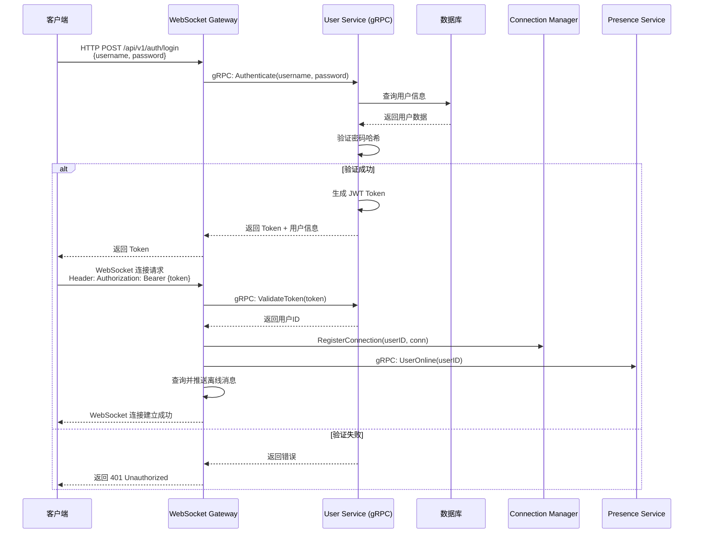
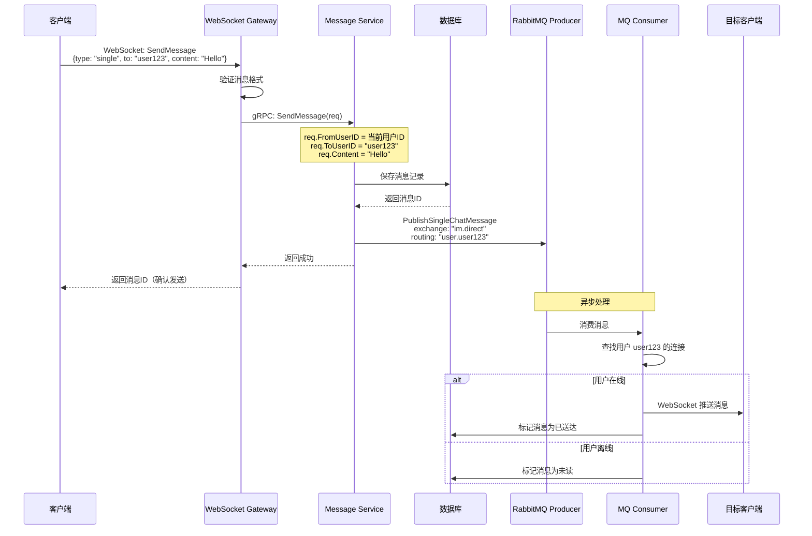
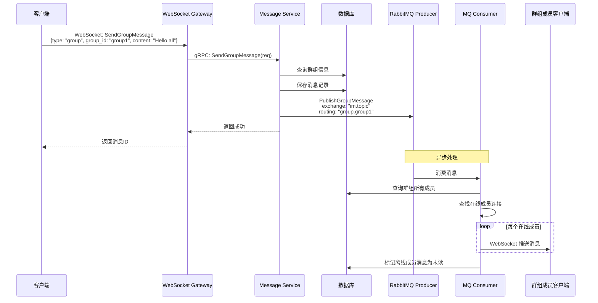
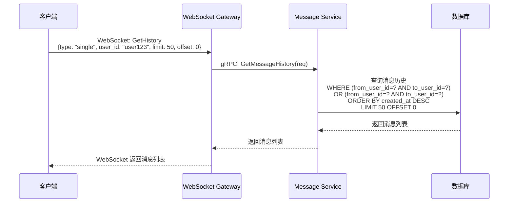
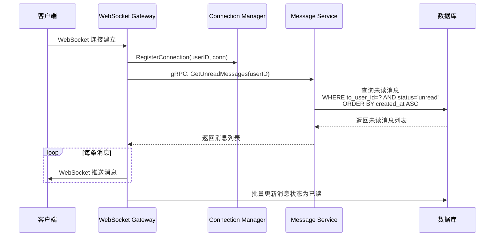
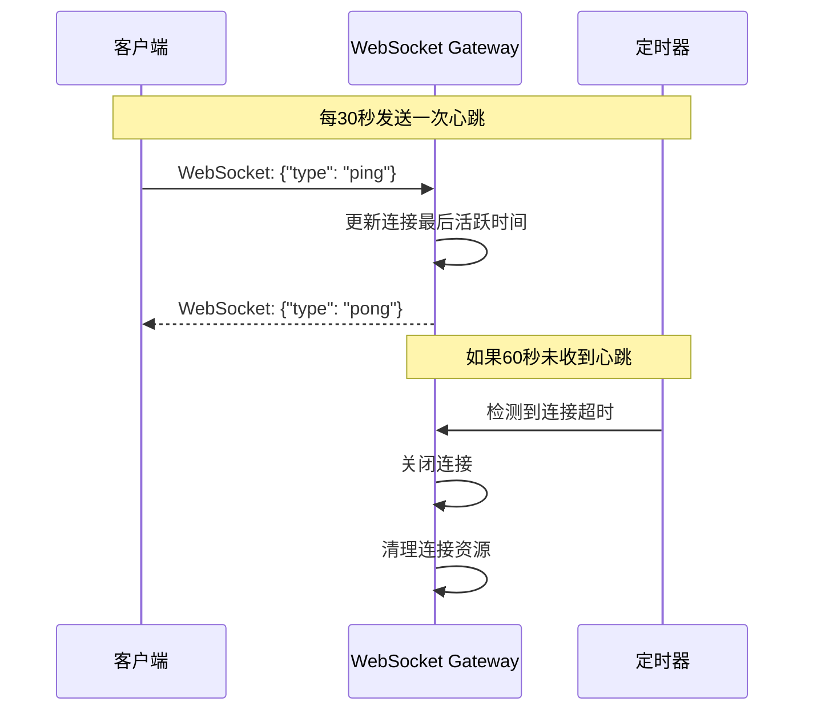

# 用户登录与操作逻辑

## 概述

本文档详细说明 IM 系统中用户登录、认证、以及各种操作（发送消息、接收消息、查询历史等）的完整流程和逻辑。

## 用户认证流程

### 1. 用户登录流程



### 2. 认证实现要点

#### JWT Token 生成

```go
// internal/service/user/auth.go
package user

import (
    "github.com/golang-jwt/jwt/v5"
    "time"
)

type Claims struct {
    UserID   string `json:"user_id"`
    Username string `json:"username"`
    jwt.RegisteredClaims
}

func (s *Service) GenerateToken(user *model.User) (string, error) {
    claims := &Claims{
        UserID:   user.ID,
        Username: user.Username,
        RegisteredClaims: jwt.RegisteredClaims{
            ExpiresAt: jwt.NewNumericDate(time.Now().Add(24 * time.Hour)),
            IssuedAt:  jwt.NewNumericDate(time.Now()),
            NotBefore: jwt.NewNumericDate(time.Now()),
        },
    }
    
    token := jwt.NewWithClaims(jwt.SigningMethodHS256, claims)
    return token.SignedString([]byte(s.secretKey))
}

func (s *Service) ValidateToken(tokenString string) (*Claims, error) {
    token, err := jwt.ParseWithClaims(tokenString, &Claims{}, func(token *jwt.Token) (interface{}, error) {
        return []byte(s.secretKey), nil
    })
    
    if err != nil {
        return nil, err
    }
    
    if claims, ok := token.Claims.(*Claims); ok && token.Valid {
        return claims, nil
    }
    
    return nil, fmt.Errorf("invalid token")
}
```

#### WebSocket 连接认证

```go
// internal/gateway/websocket/handler.go
func (h *Handler) HandleConnection(w http.ResponseWriter, r *http.Request) {
    // 从 Header 获取 Token
    token := r.Header.Get("Authorization")
    if token == "" {
        http.Error(w, "Missing authorization token", http.StatusUnauthorized)
        return
    }
    
    // 移除 "Bearer " 前缀
    if strings.HasPrefix(token, "Bearer ") {
        token = token[7:]
    }
    
    // 验证 Token
    claims, err := h.userService.ValidateToken(token)
    if err != nil {
        http.Error(w, "Invalid token", http.StatusUnauthorized)
        return
    }
    
    // 升级为 WebSocket 连接
    conn, err := h.upgrader.Upgrade(w, r, nil)
    if err != nil {
        log.Printf("WebSocket upgrade failed: %v", err)
        return
    }
    
    // 注册连接
    connection := h.connMgr.RegisterConnection(claims.UserID, conn)
    
    // 通知用户上线
    h.presenceService.UserOnline(claims.UserID)
    
    // 处理连接
    go h.handleClient(connection, claims.UserID)
}
```

## 用户操作流程

### 1. 发送单聊消息



#### 代码实现

```go
// internal/gateway/websocket/handler.go
func (h *Handler) handleClient(conn *connection.Connection, userID string) {
    defer func() {
        h.connMgr.UnregisterConnection(userID, conn.ID)
        h.presenceService.UserOffline(userID)
        conn.Close()
    }()
    
    for {
        var msg Message
        err := conn.ReadJSON(&msg)
        if err != nil {
            log.Printf("Read error: %v", err)
            break
        }
        
        switch msg.Type {
        case "send_message":
            h.handleSendMessage(conn, userID, &msg)
        case "get_history":
            h.handleGetHistory(conn, userID, &msg)
        case "ping":
            h.handlePing(conn)
        default:
            h.sendError(conn, "unknown message type")
        }
    }
}

func (h *Handler) handleSendMessage(conn *connection.Connection, fromUserID string, msg *Message) {
    // 构建 gRPC 请求
    req := &pb.SendMessageRequest{
        FromUserID: fromUserID,
        ToUserID:   msg.Data["to_user_id"].(string),
        Content:    msg.Data["content"].(string),
        MessageType: msg.Data["message_type"].(string), // text, image, file
    }
    
    // 调用 Message Service
    resp, err := h.messageService.SendMessage(context.Background(), req)
    if err != nil {
        h.sendError(conn, err.Error())
        return
    }
    
    // 返回确认
    h.sendResponse(conn, Message{
        Type: "message_sent",
        Data: map[string]interface{}{
            "message_id": resp.MessageId,
            "timestamp":  resp.Timestamp,
        },
    })
}
```

### 2. 发送群聊消息



#### 代码实现

```go
// internal/service/message/service.go
func (s *Service) SendGroupMessage(ctx context.Context, req *pb.SendGroupMessageRequest) (*pb.SendGroupMessageResponse, error) {
    // 验证用户是否在群组中
    isMember, err := s.groupService.IsMember(ctx, req.GroupID, req.FromUserID)
    if err != nil || !isMember {
        return nil, fmt.Errorf("user is not a member of the group")
    }
    
    // 保存消息到数据库
    message := &model.Message{
        ID:          uuid.New().String(),
        Type:        "group",
        FromUserID:   req.FromUserID,
        GroupID:      req.GroupID,
        Content:      req.Content,
        MessageType:  req.MessageType,
        Status:       "sent",
        CreatedAt:    time.Now(),
    }
    
    if err := s.db.Create(message).Error; err != nil {
        return nil, err
    }
    
    // 发送到消息队列
    pbMessage := &pb.Message{
        Id:          message.ID,
        Type:        "group",
        FromUserID:  req.FromUserID,
        GroupID:     req.GroupID,
        Content:     req.Content,
        MessageType: req.MessageType,
        Timestamp:   message.CreatedAt.Unix(),
    }
    
    if err := s.mqProducer.PublishGroupMessage(req.GroupID, pbMessage); err != nil {
        log.Printf("Failed to publish group message: %v", err)
        // 即使 MQ 失败，消息已保存到数据库，可以后续重试
    }
    
    return &pb.SendGroupMessageResponse{
        MessageId: message.ID,
        Timestamp: message.CreatedAt.Unix(),
    }, nil
}
```

### 3. 查询消息历史



#### 代码实现

```go
// internal/service/message/service.go
func (s *Service) GetMessageHistory(ctx context.Context, req *pb.GetMessageHistoryRequest) (*pb.GetMessageHistoryResponse, error) {
    var messages []model.Message
    
    query := s.db.Where("(from_user_id = ? AND to_user_id = ?) OR (from_user_id = ? AND to_user_id = ?)",
        req.UserID, req.TargetUserID, req.TargetUserID, req.UserID).
        Where("type = ?", "single").
        Order("created_at DESC").
        Limit(int(req.Limit)).
        Offset(int(req.Offset))
    
    if err := query.Find(&messages).Error; err != nil {
        return nil, err
    }
    
    // 转换为 protobuf 格式
    pbMessages := make([]*pb.Message, len(messages))
    for i, msg := range messages {
        pbMessages[i] = &pb.Message{
            Id:          msg.ID,
            Type:        msg.Type,
            FromUserID:  msg.FromUserID,
            ToUserID:    msg.ToUserID,
            Content:     msg.Content,
            MessageType: msg.MessageType,
            Timestamp:   msg.CreatedAt.Unix(),
        }
    }
    
    return &pb.GetMessageHistoryResponse{
        Messages: pbMessages,
    }, nil
}
```

### 4. 接收离线消息

当用户上线时，系统会自动推送离线期间收到的未读消息。



#### 代码实现

```go
// internal/gateway/websocket/handler.go
func (h *Handler) handleClient(conn *connection.Connection, userID string) {
    // 注册连接后，立即推送离线消息
    go h.pushOfflineMessages(conn, userID)
    
    // ... 处理其他消息
}

func (h *Handler) pushOfflineMessages(conn *connection.Connection, userID string) {
    req := &pb.GetUnreadMessagesRequest{
        UserID: userID,
    }
    
    resp, err := h.messageService.GetUnreadMessages(context.Background(), req)
    if err != nil {
        log.Printf("Failed to get unread messages: %v", err)
        return
    }
    
    // 推送离线消息
    for _, msg := range resp.Messages {
        h.sendMessage(conn, Message{
            Type: "message",
            Data: map[string]interface{}{
                "id":           msg.Id,
                "type":         msg.Type,
                "from_user_id": msg.FromUserID,
                "to_user_id":   msg.ToUserID,
                "content":      msg.Content,
                "message_type": msg.MessageType,
                "timestamp":    msg.Timestamp,
            },
        })
    }
    
    // 标记为已读
    if len(resp.Messages) > 0 {
        messageIDs := make([]string, len(resp.Messages))
        for i, msg := range resp.Messages {
            messageIDs[i] = msg.Id
        }
        h.messageService.MarkAsRead(context.Background(), &pb.MarkAsReadRequest{
            UserID:    userID,
            MessageIDs: messageIDs,
        })
    }
}
```

## 心跳机制

为了保持 WebSocket 连接活跃，客户端需要定期发送心跳消息。

### 心跳流程



#### 代码实现

```go
// internal/gateway/websocket/handler.go
func (h *Handler) handleClient(conn *connection.Connection, userID string) {
    // 设置读取超时
    conn.SetReadDeadline(time.Now().Add(60 * time.Second))
    conn.SetPongHandler(func(string) error {
        conn.SetReadDeadline(time.Now().Add(60 * time.Second))
        return nil
    })
    
    // 启动心跳检测
    ticker := time.NewTicker(30 * time.Second)
    defer ticker.Stop()
    
    go func() {
        for {
            select {
            case <-ticker.C:
                if err := conn.WriteMessage(websocket.PingMessage, nil); err != nil {
                    return
                }
            }
        }
    }()
    
    for {
        var msg Message
        err := conn.ReadJSON(&msg)
        if err != nil {
            if websocket.IsUnexpectedCloseError(err, websocket.CloseGoingAway, websocket.CloseAbnormalClosure) {
                log.Printf("WebSocket error: %v", err)
            }
            break
        }
        
        // 重置读取超时
        conn.SetReadDeadline(time.Now().Add(60 * time.Second))
        
        switch msg.Type {
        case "ping":
            h.handlePing(conn)
        // ... 其他消息类型
        }
    }
}

func (h *Handler) handlePing(conn *connection.Connection) {
    h.sendResponse(conn, Message{
        Type: "pong",
        Data: map[string]interface{}{
            "timestamp": time.Now().Unix(),
        },
    })
}
```

## 错误处理

### 错误响应格式

```json
{
    "type": "error",
    "code": "INVALID_MESSAGE",
    "message": "Invalid message format",
    "timestamp": 1234567890
}
```

### 常见错误码

- `UNAUTHORIZED`: 未授权，Token 无效或过期
- `INVALID_MESSAGE`: 消息格式错误
- `USER_NOT_FOUND`: 目标用户不存在
- `NOT_GROUP_MEMBER`: 不是群组成员
- `MESSAGE_SEND_FAILED`: 消息发送失败
- `RATE_LIMIT_EXCEEDED`: 请求频率过高

### 错误处理实现

```go
// internal/gateway/websocket/handler.go
func (h *Handler) sendError(conn *connection.Connection, code, message string) {
    h.sendResponse(conn, Message{
        Type: "error",
        Data: map[string]interface{}{
            "code":      code,
            "message":   message,
            "timestamp": time.Now().Unix(),
        },
    })
}

func (h *Handler) sendResponse(conn *connection.Connection, msg Message) {
    if err := conn.WriteJSON(msg); err != nil {
        log.Printf("Failed to send response: %v", err)
    }
}
```

## 安全考虑

1. **Token 验证**：所有 WebSocket 连接必须携带有效的 JWT Token
2. **消息验证**：验证消息格式、目标用户是否存在、用户是否有权限
3. **频率限制**：限制用户发送消息的频率，防止刷屏
4. **内容过滤**：对消息内容进行敏感词过滤
5. **连接数限制**：限制单个用户的并发连接数

## 性能优化

1. **消息批量推送**：离线消息批量推送，减少网络请求
2. **连接池管理**：使用连接池管理数据库连接
3. **消息缓存**：热点消息缓存到 Redis
4. **异步处理**：消息发送异步处理，立即返回响应
5. **负载均衡**：多个 Gateway 实例负载均衡，支持水平扩展