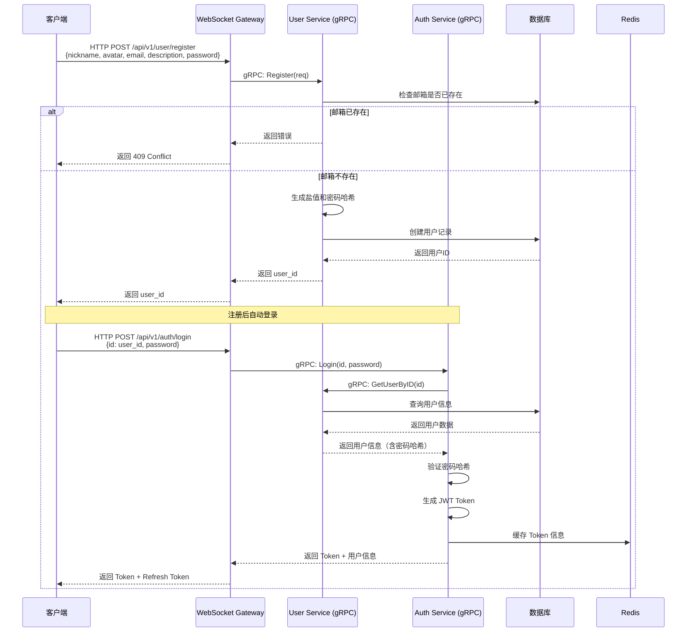
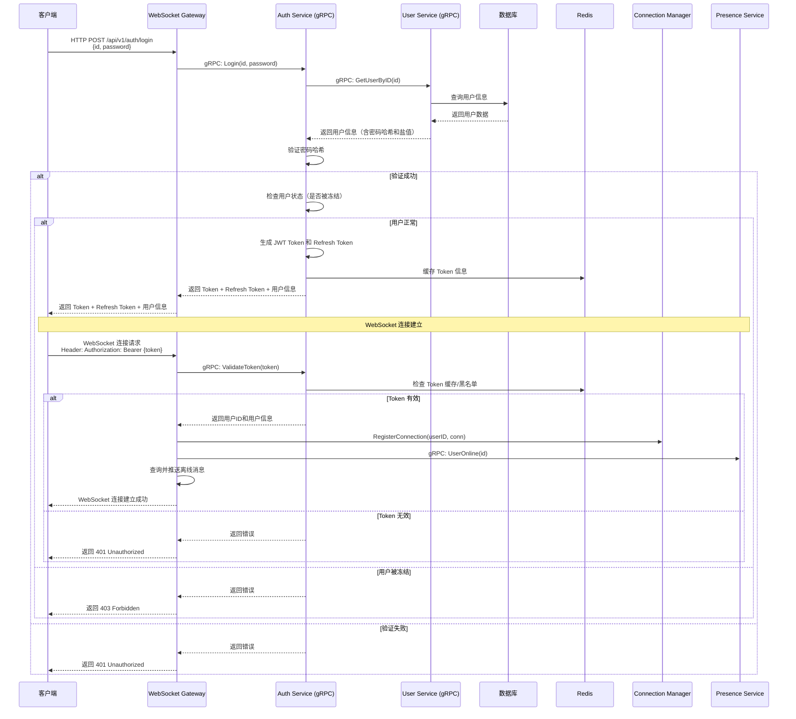
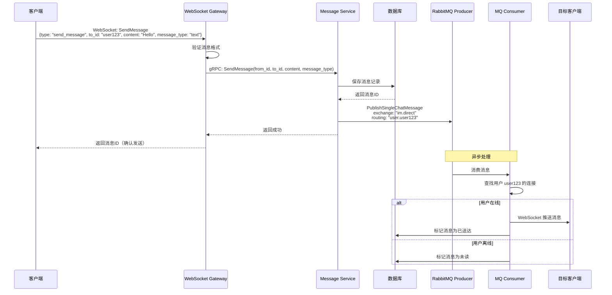
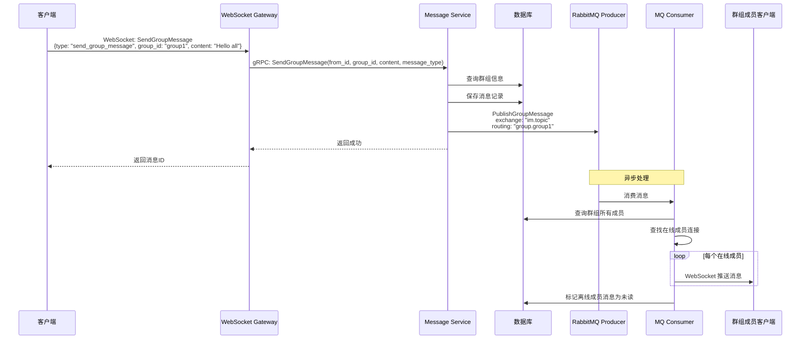
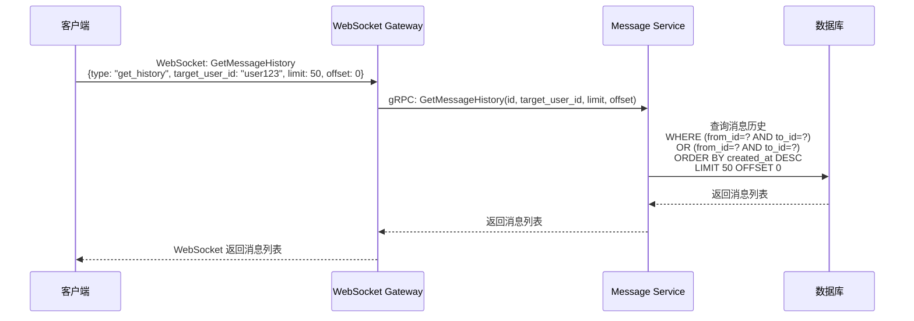
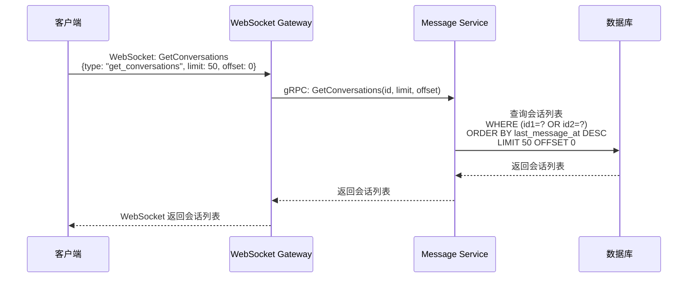
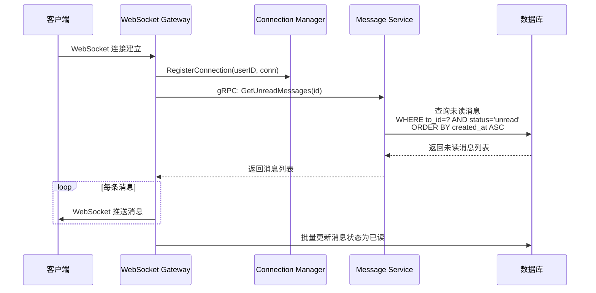
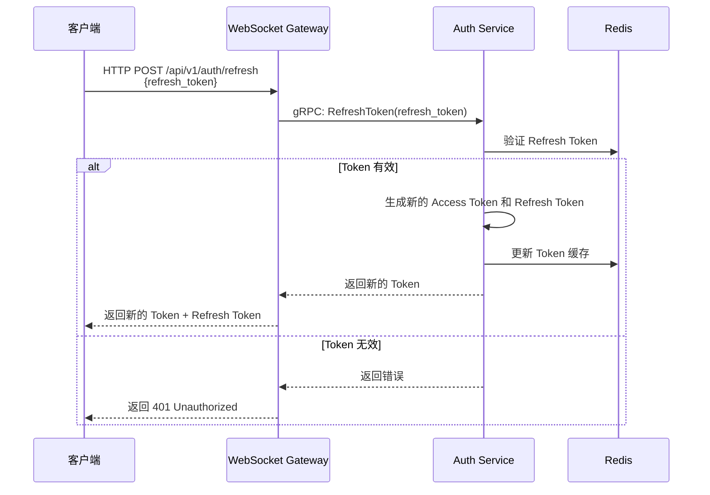
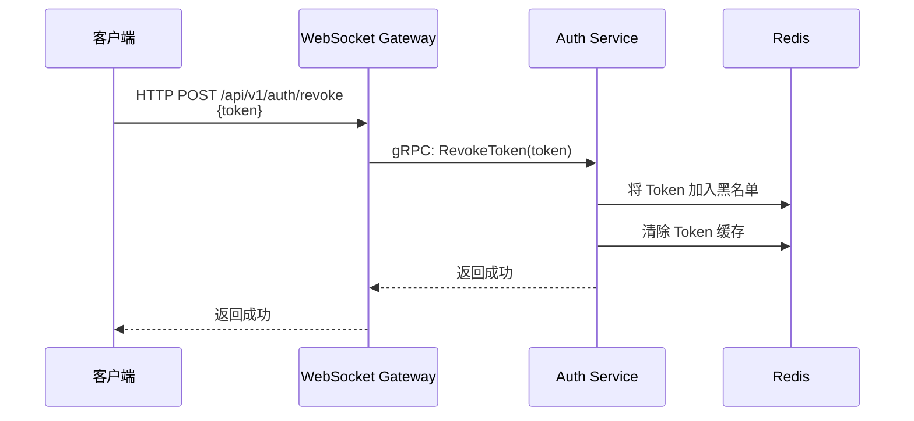

# 用户登录与操作逻辑

## 概述

本文档详细说明 IM 系统中用户注册、登录、认证、以及各种操作（发送消息、接收消息、查询历史等）的完整流程和逻辑。

## 用户注册流程

### 1. 注册流程



### 2. 注册实现要点

**User Service Register RPC**：

```go
func (s *Service) Register(ctx context.Context, req *pb.RegisterRequest) (*pb.RegisterResponse, error) {
    // 1. 检查邮箱是否已存在
    var existingUser model.User
    if err := db.DB.Where("email = ?", req.Email).First(&existingUser).Error; err == nil {
        return nil, status.Error(codes.AlreadyExists, "email already exists")
    }
    
    // 2. 生成盐值和密码哈希
    salt, err := s.generateSalt()
    if err != nil {
        return nil, status.Error(codes.Internal, "failed to generate salt")
    }
    
    passwordHash := s.hashPassword(req.Password, salt)
    
    // 3. 创建用户
    user := &model.User{
        ID:           uuid.New().String(),
        Nickname:     req.Nickname,
        Avatar:       req.Avatar,
        Email:        req.Email,
        Description:  req.Description,
        Salt:         salt,
        PasswordHash: passwordHash,
        Level:        0,  // 普通用户
        Status:       "offline",
    }
    
    if err := db.DB.Create(user).Error; err != nil {
        return nil, status.Error(codes.Internal, "failed to create user")
    }
    
    return &pb.RegisterResponse{
        Id: user.ID,
    }, nil
}
```

## 用户登录流程

### 1. 登录流程



### 2. 认证实现要点

#### Auth Service Login RPC

```go
// internal/service/auth/service.go
func (s *Service) Login(ctx context.Context, req *pb.LoginRequest) (*pb.LoginResponse, error) {
    // 1. 调用 User Service 获取用户信息（包含密码哈希和盐值）
    userReq := &userpb.GetUserByIDRequest{Id: req.Id}
    userResp, err := s.userService.GetUserByID(ctx, userReq)
    if err != nil {
        return nil, status.Error(codes.Unauthenticated, "invalid credentials")
    }
    
    // 2. 验证密码
    passwordHash := s.hashPassword(req.Password, userResp.Salt)
    if passwordHash != userResp.PasswordHash {
        return nil, status.Error(codes.Unauthenticated, "invalid credentials")
    }
    
    // 3. 检查用户状态
    if userResp.User.Status == "frozen" || !userResp.User.FreezeTime.IsZero() {
        return nil, status.Error(codes.PermissionDenied, "user is frozen")
    }
    
    // 4. 生成 Token
    token, err := s.generateToken(userResp.User.Id, userResp.User.Email)
    if err != nil {
        return nil, status.Error(codes.Internal, "failed to generate token")
    }
    
    // 5. 生成 Refresh Token
    refreshToken, err := s.generateRefreshToken(userResp.User.Id)
    if err != nil {
        return nil, status.Error(codes.Internal, "failed to generate refresh token")
    }
    
    // 6. 缓存 Token 信息
    s.cacheToken(token, userResp.User.Id)
    
    return &pb.LoginResponse{
        Token:        token,
        RefreshToken: refreshToken,
        ExpiresAt:    time.Now().Add(time.Duration(s.config.JWT.ExpireHours) * time.Hour).Unix(),
        User: &pb.UserInfo{
            Id:          userResp.User.Id,
            Nickname:    userResp.User.Nickname,
            Avatar:      userResp.User.Avatar,
            Email:       userResp.User.Email,
            Description: userResp.User.Description,
            Level:       userResp.User.Level,
            Status:      userResp.User.Status,
        },
    }, nil
}
```

#### WebSocket 连接认证

```go
// internal/gateway/websocket/handler.go
func (h *Handler) HandleConnection(w http.ResponseWriter, r *http.Request) {
    // 从 Header 获取 Token
    token := extractToken(r)
    if token == "" {
        http.Error(w, "Missing authorization token", http.StatusUnauthorized)
        return
    }
    
    // 调用 Auth Service 验证 Token
    req := &pb.ValidateTokenRequest{Token: token}
    resp, err := h.authService.ValidateToken(context.Background(), req)
    if err != nil || !resp.Valid {
        http.Error(w, "Invalid token", http.StatusUnauthorized)
        return
    }
    
    // 升级为 WebSocket 连接
    conn, err := h.upgrader.Upgrade(w, r, nil)
    if err != nil {
        log.Printf("WebSocket upgrade failed: %v", err)
        return
    }
    
    // 注册连接
    connection := h.connMgr.RegisterConnection(resp.Id, conn)
    
    // 通知用户上线
    h.presenceService.UserOnline(&presencepb.UserOnlineRequest{Id: resp.Id})
    
    // 处理连接
    go h.handleClient(connection, resp.Id)
}

func extractToken(r *http.Request) string {
    // 从 Header 获取
    token := r.Header.Get("Authorization")
    if token != "" && strings.HasPrefix(token, "Bearer ") {
        return token[7:]
    }
    
    // 从 Query 参数获取（备用方案）
    token = r.URL.Query().Get("token")
    return token
}
```

## 用户操作流程

### 1. 发送单聊消息



#### 代码实现

```go
// internal/gateway/websocket/handler.go
func (h *Handler) handleSendMessage(conn *connection.Connection, fromID string, msg *Message) {
    // 构建 gRPC 请求
    req := &pb.SendMessageRequest{
        FromId:     fromID,
        ToId:       msg.Data["to_id"].(string),
        Content:    msg.Data["content"].(string),
        MessageType: msg.Data["message_type"].(string), // text, image, file
    }
    
    // 调用 Message Service
    resp, err := h.messageService.SendMessage(context.Background(), req)
    if err != nil {
        h.sendError(conn, "MESSAGE_SEND_FAILED", err.Error())
        return
    }
    
    // 返回确认
    h.sendResponse(conn, Message{
        Type: "message_sent",
        Data: map[string]interface{}{
            "message_id": resp.MessageId,
            "created_at":  resp.CreatedAt,
        },
    })
}
```

### 2. 发送群聊消息



### 3. 查询消息历史



### 4. 获取会话列表



### 5. 接收离线消息

当用户上线时，系统会自动推送离线期间收到的未读消息。



## Token 刷新流程



## Token 撤销流程



## 安全考虑

1. **Token 验证**：所有 WebSocket 连接必须携带有效的 JWT Token，由 Auth Service 统一验证
2. **Token 黑名单**：支持 Token 撤销，撤销的 Token 加入 Redis 黑名单
3. **消息验证**：验证消息格式、目标用户是否存在、用户是否有权限
4. **频率限制**：限制用户发送消息的频率，防止刷屏
5. **内容过滤**：对消息内容进行敏感词过滤
6. **连接数限制**：限制单个用户的并发连接数
7. **Token 缓存**：Token 验证结果缓存到 Redis，提高性能

## 性能优化

1. **消息批量推送**：离线消息批量推送，减少网络请求
2. **连接池管理**：使用连接池管理数据库连接和 gRPC 连接
3. **消息缓存**：热点消息缓存到 Redis
4. **异步处理**：消息发送异步处理，立即返回响应
5. **负载均衡**：多个 Gateway 实例负载均衡，支持水平扩展
6. **Token 缓存**：Token 验证结果缓存，减少 gRPC 调用

## 参考

- [微服务架构设计](./00-微服务架构设计.md)
- [Auth 认证架构设计](./02-Auth认证架构设计.md)
- [消息队列设计](./03-消息队列设计.md)
