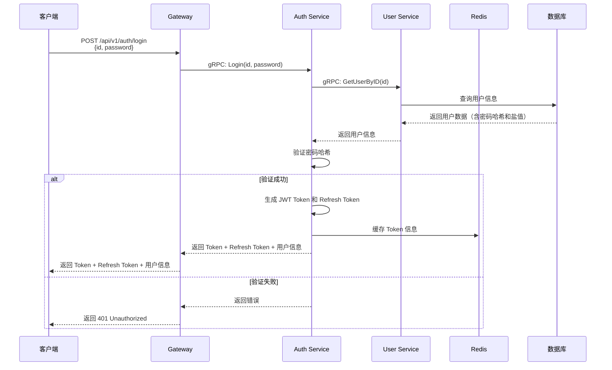
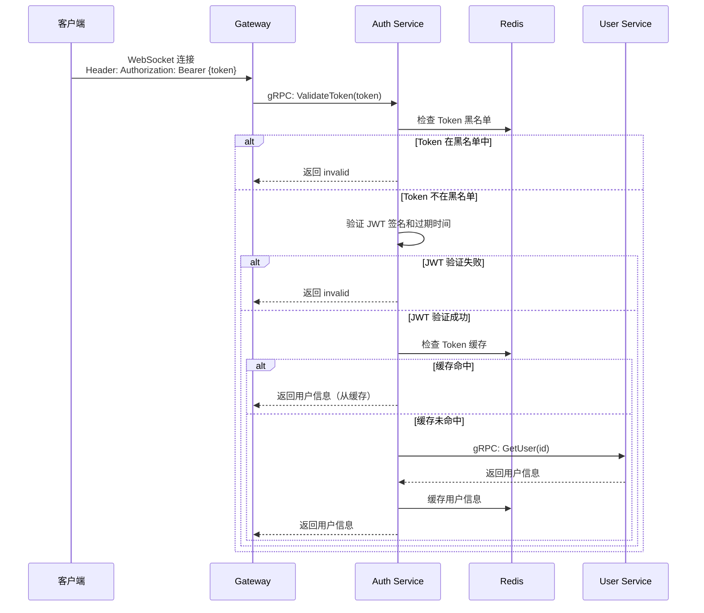
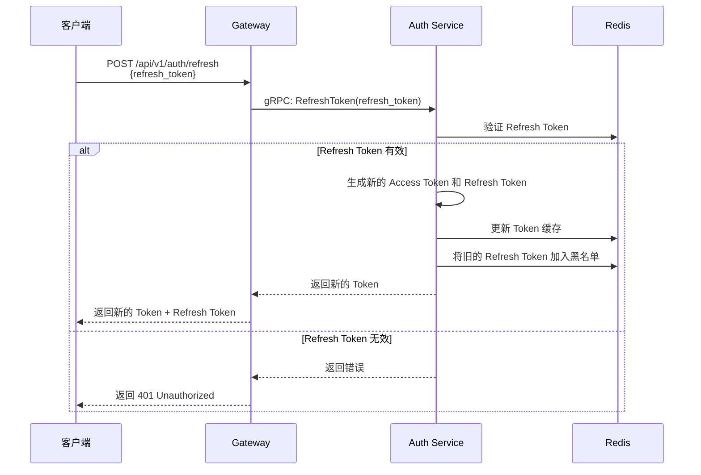
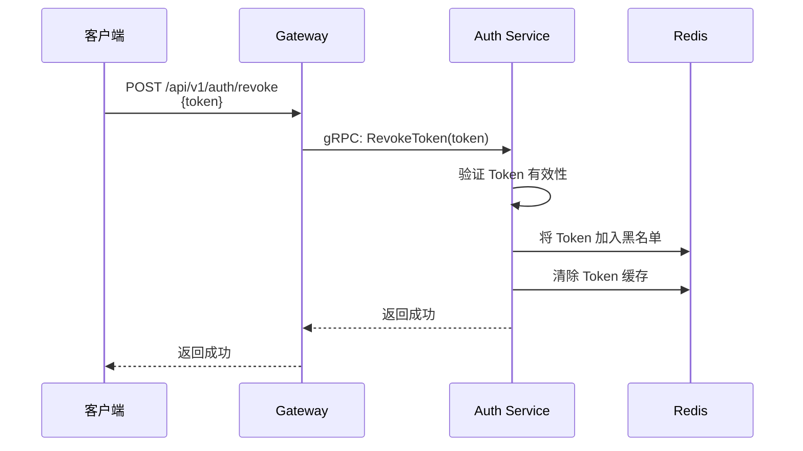

# Auth 认证架构设计

## 概述

本文档详细说明 Beehive IM 系统中 Auth Service 的认证架构设计，包括认证流程、Token 管理、安全策略等。

## 架构方案

**已选择方案：方案三（独立的 Auth Service）**

**架构优势：**
1. ✅ **职责分离**：认证和用户管理完全分离，符合单一职责原则
2. ✅ **独立扩展**：Auth Service 可以独立扩展和优化，不影响其他服务
3. ✅ **灵活性高**：可以支持多种认证方式（JWT、Refresh Token 等）
4. ✅ **易于维护**：认证逻辑集中在一个服务中，便于团队协作
5. ✅ **高性能**：通过 Redis 缓存 Token 验证结果，提升性能

## 服务职责划分

### Auth Service

**职责**：
- 用户登录验证
- JWT Token 生成和验证
- Token 刷新和撤销
- 权限验证
- Token 黑名单管理

**技术栈**：
- gRPC Server
- JWT
- Redis（Token 缓存、黑名单）
- gRPC Client（调用 User Service）

**端口**：50050

### User Service

**职责**：
- 用户注册
- 用户信息查询和更新
- 用户资料管理
- 用户状态管理

**技术栈**：
- gRPC Server
- GORM

**端口**：50051

## 认证流程

### 登录流程



### Token 验证流程



### Token 刷新流程



### Token 撤销流程



## Protocol Buffers 定义

### Auth Service Proto

```protobuf
service AuthService {
    // Login 用户登录，使用 id 和 password
    rpc Login(LoginRequest) returns (LoginResponse);
    
    // ValidateToken 验证 JWT Token，返回用户信息
    rpc ValidateToken(ValidateTokenRequest) returns (ValidateTokenResponse);
    
    // RefreshToken 刷新访问令牌
    rpc RefreshToken(RefreshTokenRequest) returns (RefreshTokenResponse);
    
    // RevokeToken 撤销令牌（加入黑名单）
    rpc RevokeToken(RevokeTokenRequest) returns (RevokeTokenResponse);
}

message LoginRequest {
    string id = 1;        // 用户ID
    string password = 2;  // 密码
}

message LoginResponse {
    string token = 1;              // 访问令牌
    string refresh_token = 2;      // 刷新令牌
    int64 expires_at = 3;          // 令牌过期时间（Unix 时间戳）
    UserInfo user = 4;             // 用户信息
}

message ValidateTokenRequest {
    string token = 1;  // 要验证的令牌
}

message ValidateTokenResponse {
    bool valid = 1;        // 令牌是否有效
    string id = 2;         // 用户ID
    UserInfo user = 3;     // 用户信息（仅在 valid=true 时返回）
}
```

## 实现要点

### 1. JWT Token 生成

```go
// internal/service/auth/auth.go
func (s *Service) generateToken(userID, email string) (string, error) {
    claims := &jwt.MapClaims{
        "user_id": userID,
        "email":   email,
        "exp":     time.Now().Add(time.Duration(s.config.JWT.ExpireHours) * time.Hour).Unix(),
        "iat":     time.Now().Unix(),
        "type":    "access",
    }
    
    token := jwt.NewWithClaims(jwt.SigningMethodHS256, claims)
    tokenString, err := token.SignedString([]byte(s.config.JWT.Secret))
    if err != nil {
        return "", err
    }
    
    // 缓存 Token 信息到 Redis
    cacheKey := fmt.Sprintf("token:%s", tokenString)
    s.redis.Set(ctx, cacheKey, userID, time.Duration(s.config.JWT.ExpireHours)*time.Hour)
    
    return tokenString, nil
}
```

### 2. Token 验证

```go
func (s *Service) ValidateToken(ctx context.Context, req *pb.ValidateTokenRequest) (*pb.ValidateTokenResponse, error) {
    // 1. 检查 Redis 黑名单
    blacklistKey := fmt.Sprintf("token:blacklist:%s", req.Token)
    exists, _ := s.redis.Exists(ctx, blacklistKey).Result()
    if exists > 0 {
        return &pb.ValidateTokenResponse{Valid: false}, nil
    }
    
    // 2. 验证 JWT 签名和过期时间
    token, err := jwt.ParseWithClaims(req.Token, &Claims{}, func(token *jwt.Token) (interface{}, error) {
        return []byte(s.config.JWT.Secret), nil
    })
    
    if err != nil {
        return &pb.ValidateTokenResponse{Valid: false}, nil
    }
    
    if claims, ok := token.Claims.(*Claims); ok && token.Valid {
        // 3. 检查缓存
        cacheKey := fmt.Sprintf("token:%s", req.Token)
        cachedUserID := s.redis.Get(ctx, cacheKey).Val()
        
        if cachedUserID != "" {
            // 缓存命中，直接返回
            user, _ := s.getUserInfo(ctx, cachedUserID)
            return &pb.ValidateTokenResponse{
                Valid: true,
                Id:    claims.UserID,
                User:  user,
            }, nil
        }
        
        // 4. 缓存未命中，查询用户信息
        user, err := s.getUserInfo(ctx, claims.UserID)
        if err != nil {
            return &pb.ValidateTokenResponse{Valid: false}, nil
        }
        
        // 5. 缓存结果
        s.redis.Set(ctx, cacheKey, claims.UserID, time.Duration(s.config.JWT.ExpireHours)*time.Hour)
        
        return &pb.ValidateTokenResponse{
            Valid: true,
            Id:    claims.UserID,
            User:  user,
        }, nil
    }
    
    return &pb.ValidateTokenResponse{Valid: false}, nil
}
```

### 3. Token 撤销

```go
func (s *Service) RevokeToken(ctx context.Context, req *pb.RevokeTokenRequest) (*pb.RevokeTokenResponse, error) {
    // 1. 验证 Token 有效性
    claims, err := s.validateJWT(req.Token)
    if err != nil {
        return &pb.RevokeTokenResponse{Success: false}, nil
    }
    
    // 2. 加入黑名单
    blacklistKey := fmt.Sprintf("token:blacklist:%s", req.Token)
    expireTime := time.Duration(s.config.JWT.ExpireHours) * time.Hour
    s.redis.Set(ctx, blacklistKey, "1", expireTime)
    
    // 3. 清除缓存
    cacheKey := fmt.Sprintf("token:%s", req.Token)
    s.redis.Del(ctx, cacheKey)
    
    return &pb.RevokeTokenResponse{Success: true}, nil
}
```

## 安全策略

### 1. JWT Secret 管理

- **不要硬编码 Secret**：使用环境变量或配置中心
- **定期轮换 Secret**：实现 Secret 轮换机制
- **最小权限原则**：Auth Service 持有 Secret，其他服务不持有
- **审计日志**：记录所有认证相关的操作

### 2. Token 验证策略

1. **签名验证**：必须验证 JWT 签名
2. **过期检查**：检查 Token 是否过期
3. **黑名单检查**：检查 Token 是否在黑名单中
4. **用户状态**：验证用户是否被禁用（需要查询 User Service）
5. **缓存优化**：Token 验证结果缓存到 Redis

### 3. 密码安全

- **盐值加密**：每个用户使用唯一的盐值
- **哈希算法**：使用 SHA-256 哈希
- **密码策略**：强制密码复杂度要求
- **密码重置**：实现安全的密码重置流程

### 4. 频率限制

- **登录限制**：限制登录尝试次数，防止暴力破解
- **Token 刷新限制**：限制 Token 刷新频率
- **请求限制**：对认证接口实施频率限制

## 性能优化

### 1. Token 缓存

- **缓存策略**：Token 验证结果缓存到 Redis
- **缓存时间**：与 Token 过期时间一致
- **缓存键**：使用 Token 作为键，用户ID 作为值

### 2. 连接池

- **gRPC 连接池**：复用 gRPC 连接到 User Service
- **Redis 连接池**：使用 Redis 连接池提高性能

### 3. 批量操作

- **批量验证**：支持批量验证 Token（未来扩展）
- **批量查询**：批量查询用户信息

## 监控和日志

### 1. 监控指标

- Token 验证成功率
- Token 验证延迟
- 缓存命中率
- 登录失败次数
- Token 刷新次数

### 2. 日志记录

- 所有登录尝试（成功/失败）
- Token 验证结果
- Token 撤销操作
- 异常情况（如 Token 伪造尝试）

## 配置示例

```yaml
# configs/auth-service.yaml
server:
  auth_service_port: 50050

jwt:
  secret: your-secret-key-change-in-production
  expire_hours: 24
  refresh_expire_hours: 168  # 7 days

redis:
  addr: localhost:6379
  password: ""
  db: 0

grpc:
  user_service_addr: localhost:50051

log:
  level: info
  format: json
```

## 参考

- [微服务架构设计](./00-微服务架构设计.md)
- [用户登录与操作逻辑](./01-用户登录与操作逻辑.md)
- [消息队列设计](./03-消息队列设计.md)
