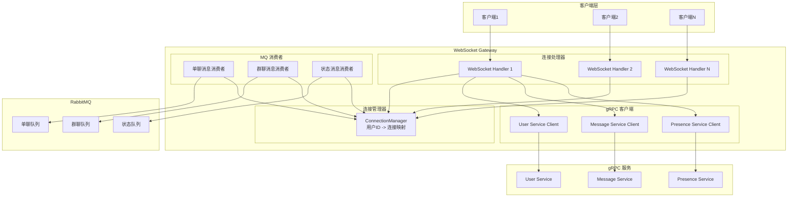

# WebSocket Gateway 设计文档

## 概述

WebSocket Gateway 是 IM 系统的入口，负责管理所有客户端的 WebSocket 连接，处理消息的接收和推送。本文档详细说明 Gateway 的架构设计、核心组件和实现细节。

## 架构设计

### 整体架构



## 核心组件

### 1. Connection Manager（连接管理器）

连接管理器负责维护所有活跃的 WebSocket 连接，提供用户ID到连接的映射关系。

#### 数据结构设计

```go
// internal/gateway/connection/manager.go
package connection

import (
    "sync"
    "github.com/gorilla/websocket"
)

type Connection struct {
    ID       string
    UserID   string
    Conn     *websocket.Conn
    Send     chan []byte
    LastPing time.Time
    mu       sync.Mutex
}

type Manager struct {
    // 用户ID -> 连接列表（支持多设备）
    connections map[string]map[string]*Connection
    mu          sync.RWMutex
    
    // 连接注册通道
    register    chan *Connection
    // 连接注销通道
    unregister  chan *Connection
}

func NewManager() *Manager {
    return &Manager{
        connections: make(map[string]map[string]*Connection),
        register:    make(chan *Connection),
        unregister:  make(chan *Connection),
    }
}
```

#### 核心方法

```go
// 注册连接
func (m *Manager) RegisterConnection(userID string, conn *websocket.Conn) *Connection {
    connection := &Connection{
        ID:       uuid.New().String(),
        UserID:   userID,
        Conn:     conn,
        Send:     make(chan []byte, 256),
        LastPing: time.Now(),
    }
    
    m.mu.Lock()
    if m.connections[userID] == nil {
        m.connections[userID] = make(map[string]*Connection)
    }
    m.connections[userID][connection.ID] = connection
    m.mu.Unlock()
    
    // 启动连接的读写 goroutine
    go connection.writePump()
    go connection.readPump(m)
    
    return connection
}

// 注销连接
func (m *Manager) UnregisterConnection(userID, connID string) {
    m.mu.Lock()
    defer m.mu.Unlock()
    
    if userConns, ok := m.connections[userID]; ok {
        if conn, ok := userConns[connID]; ok {
            close(conn.Send)
            delete(userConns, connID)
            if len(userConns) == 0 {
                delete(m.connections, userID)
            }
        }
    }
}

// 获取用户的所有连接（支持多设备）
func (m *Manager) GetUserConnections(userID string) []*Connection {
    m.mu.RLock()
    defer m.mu.RUnlock()
    
    userConns, ok := m.connections[userID]
    if !ok {
        return nil
    }
    
    conns := make([]*Connection, 0, len(userConns))
    for _, conn := range userConns {
        conns = append(conns, conn)
    }
    
    return conns
}

// 检查用户是否在线
func (m *Manager) IsUserOnline(userID string) bool {
    m.mu.RLock()
    defer m.mu.RUnlock()
    
    userConns, ok := m.connections[userID]
    return ok && len(userConns) > 0
}
```

#### 连接的生命周期管理

```go
// internal/gateway/connection/connection.go
func (c *Connection) readPump(m *Manager) {
    defer func() {
        m.UnregisterConnection(c.UserID, c.ID)
        c.Conn.Close()
    }()
    
    c.Conn.SetReadDeadline(time.Now().Add(60 * time.Second))
    c.Conn.SetPongHandler(func(string) error {
        c.Conn.SetReadDeadline(time.Now().Add(60 * time.Second))
        c.mu.Lock()
        c.LastPing = time.Now()
        c.mu.Unlock()
        return nil
    })
    
    for {
        _, message, err := c.Conn.ReadMessage()
        if err != nil {
            if websocket.IsUnexpectedCloseError(err, websocket.CloseGoingAway, websocket.CloseAbnormalClosure) {
                log.Printf("WebSocket error: %v", err)
            }
            break
        }
        
        // 处理接收到的消息
        c.handleMessage(message, m)
        
        c.Conn.SetReadDeadline(time.Now().Add(60 * time.Second))
    }
}

func (c *Connection) writePump() {
    ticker := time.NewTicker(30 * time.Second)
    defer func() {
        ticker.Stop()
        c.Conn.Close()
    }()
    
    for {
        select {
        case message, ok := <-c.Send:
            c.Conn.SetWriteDeadline(time.Now().Add(10 * time.Second))
            if !ok {
                c.Conn.WriteMessage(websocket.CloseMessage, []byte{})
                return
            }
            
            w, err := c.Conn.NextWriter(websocket.TextMessage)
            if err != nil {
                return
            }
            w.Write(message)
            
            // 批量发送队列中的消息
            n := len(c.Send)
            for i := 0; i < n; i++ {
                w.Write([]byte{'\n'})
                w.Write(<-c.Send)
            }
            
            if err := w.Close(); err != nil {
                return
            }
            
        case <-ticker.C:
            c.Conn.SetWriteDeadline(time.Now().Add(10 * time.Second))
            if err := c.Conn.WriteMessage(websocket.PingMessage, nil); err != nil {
                return
            }
        }
    }
}
```

### 2. WebSocket Handler（连接处理器）

WebSocket Handler 负责处理 HTTP 升级请求，建立 WebSocket 连接，并处理客户端消息。

#### Handler 结构

```go
// internal/gateway/websocket/handler.go
package websocket

import (
    "net/http"
    "github.com/gorilla/websocket"
)

type Handler struct {
    upgrader      websocket.Upgrader
    connMgr       *connection.Manager
    userService   userServiceClient
    messageService messageServiceClient
    presenceService presenceServiceClient
    mqConsumer    *mq.Consumer
}

func NewHandler(
    connMgr *connection.Manager,
    userSvc userServiceClient,
    msgSvc messageServiceClient,
    presSvc presenceServiceClient,
    mqConsumer *mq.Consumer,
) *Handler {
    return &Handler{
        upgrader: websocket.Upgrader{
            CheckOrigin: func(r *http.Request) bool {
                // 在生产环境中应该验证 Origin
                return true
            },
            ReadBufferSize:  1024,
            WriteBufferSize: 1024,
        },
        connMgr:        connMgr,
        userService:    userSvc,
        messageService: msgSvc,
        presenceService: presSvc,
        mqConsumer:      mqConsumer,
    }
}
```

#### 连接建立处理

```go
// 处理 WebSocket 连接请求
func (h *Handler) HandleConnection(w http.ResponseWriter, r *http.Request) {
    // 1. 从 Header 获取 Token
    token := extractToken(r)
    if token == "" {
        http.Error(w, "Missing authorization token", http.StatusUnauthorized)
        return
    }
    
    // 2. 验证 Token
    claims, err := h.userService.ValidateToken(token)
    if err != nil {
        http.Error(w, "Invalid token", http.StatusUnauthorized)
        return
    }
    
    // 3. 升级为 WebSocket 连接
    conn, err := h.upgrader.Upgrade(w, r, nil)
    if err != nil {
        log.Printf("WebSocket upgrade failed: %v", err)
        return
    }
    
    // 4. 注册连接
    connection := h.connMgr.RegisterConnection(claims.UserID, conn)
    
    // 5. 通知用户上线
    h.presenceService.UserOnline(claims.UserID)
    
    // 6. 推送离线消息
    go h.pushOfflineMessages(connection, claims.UserID)
    
    // 7. 处理客户端消息
    h.handleClient(connection, claims.UserID)
}

func extractToken(r *http.Request) string {
    // 从 Header 获取
    token := r.Header.Get("Authorization")
    if token != "" && strings.HasPrefix(token, "Bearer ") {
        return token[7:]
    }
    
    // 从 Query 参数获取（备用方案）
    token = r.URL.Query().Get("token")
    return token
}
```

#### 客户端消息处理

```go
// 处理客户端消息
func (h *Handler) handleClient(conn *connection.Connection, userID string) {
    defer func() {
        h.connMgr.UnregisterConnection(userID, conn.ID)
        h.presenceService.UserOffline(userID)
        conn.Close()
    }()
    
    for {
        var msg Message
        err := conn.ReadJSON(&msg)
        if err != nil {
            if websocket.IsUnexpectedCloseError(err, websocket.CloseGoingAway, websocket.CloseAbnormalClosure) {
                log.Printf("WebSocket error: %v", err)
            }
            break
        }
        
        // 根据消息类型分发处理
        switch msg.Type {
        case "send_message":
            h.handleSendMessage(conn, userID, &msg)
        case "send_group_message":
            h.handleSendGroupMessage(conn, userID, &msg)
        case "get_history":
            h.handleGetHistory(conn, userID, &msg)
        case "get_group_history":
            h.handleGetGroupHistory(conn, userID, &msg)
        case "ping":
            h.handlePing(conn)
        default:
            h.sendError(conn, "UNKNOWN_MESSAGE_TYPE", "Unknown message type: "+msg.Type)
        }
    }
}
```

### 3. MQ Consumer（消息队列消费者）

MQ Consumer 从 RabbitMQ 消费消息，并通过 Connection Manager 推送给对应的 WebSocket 连接。

#### Consumer 结构

```go
// internal/mq/consumer.go
package mq

import (
    "github.com/rabbitmq/amqp091-go"
)

type Consumer struct {
    conn       *amqp.Connection
    channel    *amqp.Channel
    connMgr    *connection.Manager
    gatewayID  string
}

func NewConsumer(amqpURL string, connMgr *connection.Manager, gatewayID string) (*Consumer, error) {
    conn, err := amqp.Dial(amqpURL)
    if err != nil {
        return nil, err
    }
    
    ch, err := conn.Channel()
    if err != nil {
        return nil, err
    }
    
    return &Consumer{
        conn:      conn,
        channel:   ch,
        connMgr:   connMgr,
        gatewayID: gatewayID,
    }, nil
}
```

#### 消费单聊消息

```go
// 消费单聊消息
func (c *Consumer) ConsumeSingleChatMessages() error {
    // 为当前 Gateway 创建队列
    queueName := fmt.Sprintf("queue.gateway.%s.single", c.gatewayID)
    
    _, err := c.channel.QueueDeclare(
        queueName,
        true,  // durable
        false, // delete when unused
        false, // exclusive
        false, // no-wait
        amqp.Table{
            "x-message-ttl": 86400000, // 消息TTL 24小时
        },
    )
    if err != nil {
        return err
    }
    
    // 绑定到 direct exchange，使用通配符 routing key
    err = c.channel.QueueBind(
        queueName,
        "user.*",      // routing key 模式
        "im.direct",
        false,
        nil,
    )
    if err != nil {
        return err
    }
    
    msgs, err := c.channel.Consume(
        queueName,
        "",    // consumer tag
        false, // auto-ack (手动确认)
        false, // exclusive
        false, // no-local
        false, // no-wait
        nil,
    )
    if err != nil {
        return err
    }
    
    go func() {
        for msg := range msgs {
            c.handleSingleChatMessage(msg)
        }
    }()
    
    return nil
}

func (c *Consumer) handleSingleChatMessage(delivery amqp.Delivery) {
    // 解析消息
    var pbMessage pb.Message
    if err := proto.Unmarshal(delivery.Body, &pbMessage); err != nil {
        log.Printf("Failed to unmarshal message: %v", err)
        delivery.Nack(false, false) // 拒绝消息，不重新入队
        return
    }
    
    // 查找目标用户的连接
    conns := c.connMgr.GetUserConnections(pbMessage.ToUserID)
    if len(conns) > 0 {
        // 用户在线，推送消息
        messageBytes, _ := json.Marshal(map[string]interface{}{
            "type":         "message",
            "id":           pbMessage.Id,
            "from_user_id": pbMessage.FromUserID,
            "to_user_id":   pbMessage.ToUserID,
            "content":      pbMessage.Content,
            "message_type": pbMessage.MessageType,
            "timestamp":    pbMessage.Timestamp,
        })
        
        for _, conn := range conns {
            select {
            case conn.Send <- messageBytes:
            default:
                // 发送通道已满，记录日志
                log.Printf("Connection send channel full for user: %s", pbMessage.ToUserID)
            }
        }
        
        delivery.Ack(false) // 确认消息已处理
    } else {
        // 用户离线，消息已经在数据库标记为未读
        // 直接确认消息（避免重复处理）
        delivery.Ack(false)
    }
}
```

#### 消费群聊消息

```go
// 消费群聊消息
func (c *Consumer) ConsumeGroupMessages() error {
    queueName := fmt.Sprintf("queue.gateway.%s.group", c.gatewayID)
    
    _, err := c.channel.QueueDeclare(
        queueName,
        true,
        false,
        false,
        false,
        nil,
    )
    if err != nil {
        return err
    }
    
    // 绑定到 topic exchange
    err = c.channel.QueueBind(
        queueName,
        "group.*", // 匹配所有群组消息
        "im.topic",
        false,
        nil,
    )
    if err != nil {
        return err
    }
    
    msgs, err := c.channel.Consume(
        queueName,
        "",
        false,
        false,
        false,
        false,
        nil,
    )
    if err != nil {
        return err
    }
    
    go func() {
        for msg := range msgs {
            c.handleGroupMessage(msg)
        }
    }()
    
    return nil
}

func (c *Consumer) handleGroupMessage(delivery amqp.Delivery) {
    var pbMessage pb.Message
    if err := proto.Unmarshal(delivery.Body, &pbMessage); err != nil {
        log.Printf("Failed to unmarshal group message: %v", err)
        delivery.Nack(false, false)
        return
    }
    
    // 查询群组在线成员（这里需要调用 gRPC 服务或查询缓存）
    // 简化示例：假设有方法获取群组在线成员
    onlineMembers := c.getGroupOnlineMembers(pbMessage.GroupID)
    
    messageBytes, _ := json.Marshal(map[string]interface{}{
        "type":         "group_message",
        "id":           pbMessage.Id,
        "group_id":     pbMessage.GroupID,
        "from_user_id": pbMessage.FromUserID,
        "content":      pbMessage.Content,
        "message_type": pbMessage.MessageType,
        "timestamp":    pbMessage.Timestamp,
    })
    
    // 推送给所有在线成员
    for _, userID := range onlineMembers {
        conns := c.connMgr.GetUserConnections(userID)
        for _, conn := range conns {
            select {
            case conn.Send <- messageBytes:
            default:
                log.Printf("Connection send channel full for user: %s", userID)
            }
        }
    }
    
    delivery.Ack(false)
}
```

## 消息格式

### 客户端发送的消息格式

```json
{
    "type": "send_message",
    "data": {
        "to_user_id": "user123",
        "content": "Hello",
        "message_type": "text"
    }
}
```

### 服务端推送的消息格式

```json
{
    "type": "message",
    "id": "msg123",
    "from_user_id": "user456",
    "to_user_id": "user123",
    "content": "Hello",
    "message_type": "text",
    "timestamp": 1234567890
}
```

### 错误消息格式

```json
{
    "type": "error",
    "code": "INVALID_MESSAGE",
    "message": "Invalid message format",
    "timestamp": 1234567890
}
```

## 性能优化

### 1. 连接池管理

- 使用 `sync.Map` 存储连接映射，提高并发读写性能
- 连接按用户ID分组，支持快速查找

### 2. 消息批量处理

- 使用缓冲通道批量发送消息
- 合并多个小消息为一次网络传输

### 3. 负载均衡

- 多个 Gateway 实例通过 RabbitMQ 实现消息分发
- 每个 Gateway 实例消费部分消息队列

### 4. 连接数限制

```go
// 限制单个用户的连接数
const MaxConnectionsPerUser = 5

func (m *Manager) RegisterConnection(userID string, conn *websocket.Conn) (*Connection, error) {
    m.mu.Lock()
    defer m.mu.Unlock()
    
    userConns := m.connections[userID]
    if len(userConns) >= MaxConnectionsPerUser {
        return nil, fmt.Errorf("max connections reached for user: %s", userID)
    }
    
    // ... 注册连接
}
```

## 监控和日志

### 关键指标

1. **连接数**：当前活跃连接数
2. **消息吞吐量**：每秒处理的消息数
3. **错误率**：消息处理失败率
4. **延迟**：**消息从接收到推送的延迟

### 日志记录

```go
// 记录连接建立
log.Printf("Connection established: user=%s, conn_id=%s", userID, connID)

// 记录消息处理
log.Printf("Message received: type=%s, user=%s", msg.Type, userID)

// 记录错误
log.Printf("Error processing message: user=%s, error=%v", userID, err)
```

## 部署考虑

1. **水平扩展**：支持部署多个 Gateway 实例
2. **服务发现**：使用 Consul 或 etcd 进行服务注册和发现
3. **健康检查**：提供健康检查接口，用于负载均衡器
4. **优雅关闭**：处理关闭信号，等待消息处理完成后再退出