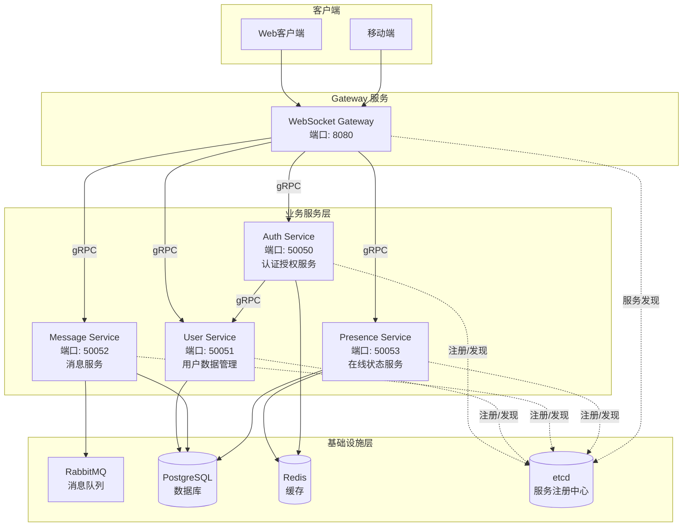

# Beehive IM 系统完整开发指南

## 概述

本文档提供从零开始构建 Beehive IM 系统的完整开发指南，包含每个阶段的详细步骤、代码示例和检查点。

## 微服务架构

Beehive IM 系统采用微服务架构，使用独立的 Auth Service 负责认证授权，包含以下微服务：

### 微服务划分



### 微服务职责

#### 1. Gateway 服务
- **职责**：WebSocket 连接管理、消息路由、客户端通信
- **端口**：8080 (HTTP/WebSocket)
- **技术**：gorilla/websocket, gRPC Client
- **特点**：无状态，可水平扩展

#### 2. Auth Service
- **职责**：用户登录、认证、JWT Token 生成和验证、权限验证
- **端口**：50050 (gRPC)
- **技术**：gRPC Server, JWT, Redis, etcd
- **数据**：Redis（Token 缓存、黑名单）

#### 3. User Service
- **职责**：用户注册、用户信息管理
- **端口**：50051 (gRPC)
- **技术**：gRPC Server, GORM, etcd
- **数据**：users 表

#### 4. Message Service
- **职责**：消息发送、消息历史、未读消息、消息状态管理
- **端口**：50052 (gRPC)
- **技术**：gRPC Server, RabbitMQ Producer, GORM
- **数据**：messages, conversations 表

#### 5. Presence Service
- **职责**：在线状态管理、用户上线/下线通知
- **端口**：50053 (gRPC)
- **技术**：gRPC Server, Redis
- **数据**：Redis (在线状态缓存)

#### 6. Search Service
- **职责**：消息全文搜索、历史消息检索、搜索结果高亮
- **端口**：50054 (gRPC)
- **技术**：gRPC Server, Elasticsearch, etcd
- **数据**：Elasticsearch (消息索引)

## 开发阶段概览


## 阶段一：项目基础搭建（第1-4天）

### 1.1 环境准备

#### 1.1.1 安装必要工具

```bash
# 检查 Go 版本（需要 1.21+）
go version

# 安装 Protocol Buffers 编译器
# macOS
brew install protobuf

# Linux
sudo apt-get install protobuf-compiler

# 安装 Go 插件
go install google.golang.org/protobuf/cmd/protoc-gen-go@latest
go install google.golang.org/grpc/cmd/protoc-gen-go-grpc@latest
```

#### 1.1.2 创建项目结构

```bash
cd /opt/Beehive

# 创建目录结构
mkdir -p pkg/api/proto/{auth,user,message,presence}/v1
mkdir -p cmd/{gateway,auth-service,user-service,message-service,presence-service}
mkdir -p internal/{gateway/{websocket,connection},service/{auth,user,message,presence},mq,pkg/{model,db,config,utils}}
mkdir -p pkg/{options,utils}
mkdir -p pkg/api/{user,message,group}/v1
mkdir -p scripts
mkdir -p docker
mkdir -p docs/dev
mkdir -p configs
```

**项目结构说明：**

```
Beehive/
├── pkg/
│   ├── api/
│   │   ├── proto/                    # Protocol Buffers 定义文件
│   │   │   ├── auth/v1/
│   │   │   ├── user/v1/
│   │   │   ├── message/v1/
│   │   │   └── presence/v1/
│   │   ├── user/v1/                  # User 数据模型
│   │   ├── message/v1/               # Message 数据模型
│   │   └── group/v1/                 # Group 数据模型
│   ├── options/                      # 命令行选项（Cobra）
│   └── utils/                        # 工具函数
├── cmd/                              # 微服务入口（Cobra 命令）
│   ├── gateway/                      # Gateway 服务
│   ├── auth-service/                 # Auth Service
│   ├── user-service/                 # User Service
│   ├── message-service/              # Message Service
│   └── presence-service/             # Presence Service
├── internal/                         # 内部实现（不对外暴露）
│   ├── gateway/                      # Gateway 服务实现
│   ├── service/                      # gRPC 服务实现
│   │   ├── auth/                     # Auth Service 实现
│   │   ├── user/                     # User Service 实现
│   │   ├── message/                  # Message Service 实现
│   │   └── presence/                 # Presence Service 实现
│   ├── mq/                           # 消息队列
│   └── pkg/                          # 内部共享包
├── configs/                          # 配置文件目录
├── scripts/                          # 脚本文件
├── docker/                           # Docker 配置
└── docs/                              # 文档
```

### 1.2 Docker 环境配置

#### 1.2.1 创建 docker-compose.yml

```yaml
# docker/docker-compose.yml
version: '3.8'

services:
  postgres:
    image: postgres:15-alpine
    container_name: beehive-postgres
    environment:
      POSTGRES_USER: postgres
      POSTGRES_PASSWORD: postgres
      POSTGRES_DB: beehive
    ports:
      - "5432:5432"
    volumes:
      - postgres_data:/var/lib/postgresql/data
    networks:
      - beehive

  rabbitmq:
    image: rabbitmq:3-management-alpine
    container_name: beehive-rabbitmq
    environment:
      RABBITMQ_DEFAULT_USER: guest
      RABBITMQ_DEFAULT_PASS: guest
    ports:
      - "5672:5672"   # AMQP 端口
      - "15672:15672" # 管理界面
    volumes:
      - rabbitmq_data:/var/lib/rabbitmq
    networks:
      - beehive

  redis:
    image: redis:7-alpine
    container_name: beehive-redis
    ports:
      - "6379:6379"
    volumes:
      - redis_data:/data
    networks:
      - beehive

  elasticsearch:
    image: docker.elastic.co/elasticsearch/elasticsearch:8.11.0
    container_name: beehive-elasticsearch
    environment:
      - discovery.type=single-node
      - xpack.security.enabled=false
      - "ES_JAVA_OPTS=-Xms512m -Xmx512m"
    ports:
      - "9200:9200"
      - "9300:9300"
    volumes:
      - es_data:/usr/share/elasticsearch/data
    networks:
      - beehive

  kibana:
    image: docker.elastic.co/kibana/kibana:8.11.0
    container_name: beehive-kibana
    environment:
      - ELASTICSEARCH_HOSTS=http://elasticsearch:9200
    ports:
      - "5601:5601"
    depends_on:
      - elasticsearch
    networks:
      - beehive

  etcd:
    image: quay.io/coreos/etcd:v3.5.11
    container_name: beehive-etcd
    environment:
      - ETCD_NAME=etcd0
      - ETCD_ADVERTISE_CLIENT_URLS=http://0.0.0.0:2379
      - ETCD_LISTEN_CLIENT_URLS=http://0.0.0.0:2379
    ports:
      - "2379:2379"
      - "2380:2380"
    volumes:
      - etcd_data:/etcd-data
    networks:
      - beehive

volumes:
  postgres_data:
  rabbitmq_data:
  redis_data:
  es_data:
  etcd_data:

networks:
  beehive:
    driver: bridge
```

## 阶段二：Protocol Buffers 定义（第5-6天）

### 2.1 生成 Go 代码

```bash
# 创建生成脚本
# scripts/generate-proto.sh
#!/bin/bash

PROTO_DIR="pkg/api/proto"
OUTPUT_DIR="pkg/api/proto"

# 生成 Auth Service
protoc --go_out=${OUTPUT_DIR}/auth/v1 \
       --go_opt=paths=source_relative \
       --go-grpc_out=${OUTPUT_DIR}/auth/v1 \
       --go-grpc_opt=paths=source_relative \
       ${PROTO_DIR}/auth/v1/auth.proto

# 生成 User Service
protoc --go_out=${OUTPUT_DIR}/user/v1 \
       --go_opt=paths=source_relative \
       --go-grpc_out=${OUTPUT_DIR}/user/v1 \
       --go-grpc_opt=paths=source_relative \
       ${PROTO_DIR}/user/v1/user.proto

# 生成 Message Service
protoc --go_out=${OUTPUT_DIR}/message/v1 \
       --go_opt=paths=source_relative \
       --go-grpc_out=${OUTPUT_DIR}/message/v1 \
       --go-grpc_opt=paths=source_relative \
       ${PROTO_DIR}/message/v1/message.proto

# 生成 Presence Service
protoc --go_out=${OUTPUT_DIR}/presence/v1 \
       --go_opt=paths=source_relative \
       --go-grpc_out=${OUTPUT_DIR}/presence/v1 \
       --go-grpc_opt=paths=source_relative \
       ${PROTO_DIR}/presence/v1/presence.proto

echo "Proto files generated successfully!"
```

```bash
chmod +x scripts/generate-proto.sh
./scripts/generate-proto.sh
```

## 阶段三：gRPC 服务实现（第7-11天）

### 3.1 Auth Service 实现

参考 [Auth 认证架构设计](./02-Auth认证架构设计.md) 文档实现。

### 3.2 User Service 实现

参考 [微服务架构设计](./00-微服务架构设计.md) 文档实现。

### 3.3 Message Service 实现

参考 [消息队列设计](./03-消息队列设计.md) 文档实现。

### 3.4 Presence Service 实现

参考 [微服务架构设计](./00-微服务架构设计.md) 文档实现。

## 阶段四：WebSocket Gateway（第12-16天）

### 4.1 Gateway Service 入口

参考 [用户登录与操作逻辑](./01-用户登录与操作逻辑.md) 文档实现。

## 阶段五：RabbitMQ 集成（第17-21天）

### 5.1 Producer 实现

参考 [消息队列设计](./03-消息队列设计.md) 文档实现。

### 5.2 Consumer 实现

参考 [消息队列设计](./03-消息队列设计.md) 文档实现。

## 阶段六：Elasticsearch 集成（第22-27天）

### 6.1 安装 IK 中文分词插件

```bash
# 进入 Elasticsearch 容器
docker exec -it beehive-elasticsearch bash

# 安装 IK 分词插件
elasticsearch-plugin install https://github.com/medcl/elasticsearch-analysis-ik/releases/download/v8.11.0/elasticsearch-analysis-ik-8.11.0.zip

# 重启容器
docker restart beehive-elasticsearch
```

### 6.2 创建消息索引

```bash
# 使用 curl 创建索引
curl -X PUT "http://localhost:9200/beehive-messages" -H 'Content-Type: application/json' -d'
{
  "settings": {
    "number_of_shards": 3,
    "number_of_replicas": 1,
    "analysis": {
      "analyzer": {
        "ik_max_word_analyzer": {
          "type": "custom",
          "tokenizer": "ik_max_word"
        },
        "ik_smart_analyzer": {
          "type": "custom",
          "tokenizer": "ik_smart"
        }
      }
    }
  },
  "mappings": {
    "properties": {
      "message_id": { "type": "keyword" },
      "type": { "type": "keyword" },
      "from_id": { "type": "keyword" },
      "to_id": { "type": "keyword" },
      "group_id": { "type": "keyword" },
      "content": {
        "type": "text",
        "analyzer": "ik_max_word_analyzer",
        "search_analyzer": "ik_smart_analyzer",
        "fields": {
          "keyword": {
            "type": "keyword",
            "ignore_above": 256
          }
        }
      },
      "message_type": { "type": "keyword" },
      "status": { "type": "keyword" },
      "created_at": {
        "type": "date",
        "format": "epoch_second"
      },
      "updated_at": {
        "type": "date",
        "format": "epoch_second"
      }
    }
  }
}
'
```

### 6.3 实现 Elasticsearch 客户端

```go
// internal/pkg/elasticsearch/client.go
package elasticsearch

import (
    "bytes"
    "context"
    "encoding/json"
    "fmt"
    "github.com/elastic/go-elasticsearch/v8"
    "github.com/elastic/go-elasticsearch/v8/esapi"
)

type Client struct {
    es *elasticsearch.Client
}

func NewClient(addresses []string) (*Client, error) {
    cfg := elasticsearch.Config{
        Addresses: addresses,
    }
    
    es, err := elasticsearch.NewClient(cfg)
    if err != nil {
        return nil, err
    }
    
    return &Client{es: es}, nil
}

func (c *Client) IndexMessage(ctx context.Context, message *model.Message) error {
    doc := map[string]interface{}{
        "message_id":   message.ID,
        "type":         message.Type,
        "from_id":      message.FromID,
        "to_id":        message.ToID,
        "group_id":     message.GroupID,
        "content":      message.Content,
        "message_type": message.MessageType,
        "status":       message.Status,
        "created_at":   message.CreatedAt.Unix(),
        "updated_at":   message.UpdatedAt.Unix(),
    }
    
    var buf bytes.Buffer
    if err := json.NewEncoder(&buf).Encode(doc); err != nil {
        return err
    }
    
    req := esapi.IndexRequest{
        Index:      "beehive-messages",
        DocumentID: message.ID,
        Body:       &buf,
        Refresh:    "true",
    }
    
    res, err := req.Do(ctx, c.es)
    if err != nil {
        return err
    }
    defer res.Body.Close()
    
    if res.IsError() {
        return fmt.Errorf("error indexing document: %s", res.String())
    }
    
    return nil
}
```

### 6.4 在 Message Service 中集成 Elasticsearch

```go
// internal/beehive-message/service/service.go
func (s *Service) SendMessage(ctx context.Context, req *pb.SendMessageRequest) (*pb.SendMessageResponse, error) {
    // 1. 保存消息到数据库
    message := &model.Message{
        ID:          id.GenID(),
        Type:        "single",
        FromID:      req.FromId,
        ToID:        req.ToId,
        Content:     req.Content,
        MessageType: req.MessageType,
        Status:      "sent",
        CreatedAt:   time.Now(),
        UpdatedAt:   time.Now(),
    }
    
    if err := s.store.CreateMessage(ctx, message); err != nil {
        return nil, err
    }
    
    // 2. 异步索引到 Elasticsearch
    go func() {
        if err := s.esClient.IndexMessage(context.Background(), message); err != nil {
            log.Printf("Failed to index message to ES: %v", err)
        }
    }()
    
    // 3. 发布到 RabbitMQ
    if err := s.producer.PublishSingleChatMessage(req.ToId, message); err != nil {
        return nil, err
    }
    
    return &pb.SendMessageResponse{
        MessageId: message.ID,
        CreatedAt: message.CreatedAt.Unix(),
    }, nil
}
```

### 6.5 实现 Search Service

参考 [Elasticsearch 搜索架构设计](./05-Elasticsearch搜索架构设计.md) 文档实现 Search Service。

**关键步骤**：
1. 创建 `pkg/api/proto/search/v1/search.proto`
2. 实现 `internal/beehive-search/service/service.go`
3. 创建 `cmd/beehive-search/main.go`
4. 添加配置文件 `configs/beehive-search-example.yaml`

### 6.6 测试搜索功能

```bash
# 启动 Search Service
go run cmd/beehive-search/main.go

# 使用 grpcurl 测试搜索
grpcurl -plaintext -d '{
  "user_id": "user_001",
  "keyword": "你好",
  "limit": 10,
  "offset": 0
}' localhost:50054 search.v1.SearchService/SearchMessages
```

### 6.7 批量同步历史数据

创建批量同步工具：

```go
// cmd/tools/sync-to-es/main.go
package main

import (
    "context"
    "log"
)

func main() {
    // 连接数据库
    db := connectDB()
    
    // 连接 Elasticsearch
    esClient := connectES()
    
    // 分页查询消息
    offset := 0
    batchSize := 1000
    
    for {
        messages, err := db.GetMessages(offset, batchSize)
        if err != nil {
            log.Fatal(err)
        }
        
        if len(messages) == 0 {
            break
        }
        
        // 批量索引
        if err := esClient.BulkIndexMessages(messages); err != nil {
            log.Printf("Failed to bulk index: %v", err)
        }
        
        offset += batchSize
        log.Printf("Synced %d messages", offset)
    }
    
    log.Println("Sync completed!")
}
```

运行同步：

```bash
go run cmd/tools/sync-to-es/main.go
```

## 阶段七：测试和优化（第28-36天）

### 7.1 单元测试

为每个服务编写单元测试。

### 7.2 集成测试

编写端到端的集成测试。

### 7.3 性能优化

优化性能瓶颈，添加缓存和连接池。

### 7.4 Elasticsearch 性能优化

- 调整分片和副本数量
- 配置批量索引
- 优化搜索查询
- 配置索引生命周期管理（ILM）

## 每日开发检查清单

### 第1天：环境搭建
- [ ] Go 环境配置
- [ ] Docker 环境配置
- [ ] 项目结构创建
- [ ] 依赖安装

### 第2天：配置和数据库
- [ ] 配置文件实现
- [ ] 数据库表设计
- [ ] 数据模型实现
- [ ] 数据库连接测试

### 第3-4天：Protocol Buffers
- [ ] Proto 文件定义
- [ ] 代码生成
- [ ] 验证生成代码

### 第5-9天：gRPC 服务
- [ ] Auth Service 实现
- [ ] User Service 实现
- [ ] Message Service 实现
- [ ] Presence Service 实现
- [ ] 服务测试

### 第10-13天：WebSocket Gateway
- [ ] Connection Manager
- [ ] WebSocket Handler
- [ ] 消息处理逻辑
- [ ] 集成测试

### 第14-16天：RabbitMQ
- [ ] Producer 实现
- [ ] Consumer 实现
- [ ] Exchange 和 Queue 配置
- [ ] 消息路由测试

### 第17-19天：Elasticsearch 集成
- [ ] 安装 IK 分词插件
- [ ] 创建消息索引
- [ ] Elasticsearch 客户端实现
- [ ] Message Service 集成 ES

### 第20-22天：Search Service
- [ ] Proto 定义
- [ ] 搜索服务实现
- [ ] 搜索功能测试
- [ ] 历史数据同步

### 第23-26天：功能完善
- [ ] 离线消息处理
- [ ] 群聊功能
- [ ] 在线状态
- [ ] 错误处理

### 第27-32天：测试和优化
- [ ] 单元测试
- [ ] 集成测试
- [ ] 性能优化
- [ ] Elasticsearch 性能优化
- [ ] 文档完善

## 常见问题排查

### 问题1：数据库连接失败
- 检查 Docker 容器是否运行
- 检查连接配置
- 检查网络端口

### 问题2：gRPC 服务启动失败
- 检查端口是否被占用
- 检查 proto 文件是否正确生成
- 检查依赖是否正确安装

### 问题3：RabbitMQ 连接失败
- 检查 RabbitMQ 容器状态
- 检查连接 URL
- 检查 Exchange 和 Queue 是否创建

### 问题4：Token 验证失败
- 检查 JWT Secret 配置
- 检查 Redis 连接
- 检查 Token 是否过期

## 下一步

完成基础功能后，可以考虑：
1. 添加文件上传功能
2. 实现消息撤回
3. 实现消息加密
4. 添加管理后台
5. 实现分布式部署
6. 添加更多搜索功能（图片搜索、文件搜索等）
7. 实现搜索结果聚合统计

## 参考文档

- [微服务架构设计](./00-微服务架构设计.md)
- [用户登录与操作逻辑](./01-用户登录与操作逻辑.md)
- [Auth 认证架构设计](./02-Auth认证架构设计.md)
- [消息队列设计](./03-消息队列设计.md)
- [Elasticsearch 搜索架构设计](./05-Elasticsearch搜索架构设计.md)
