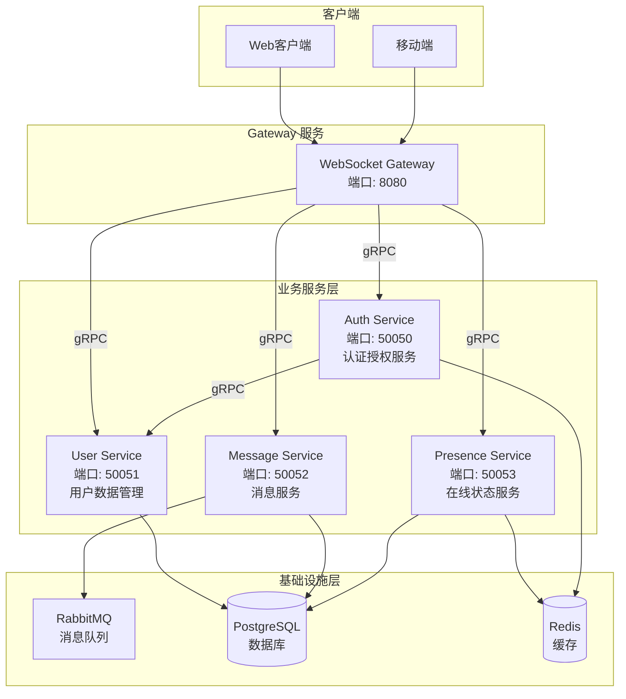
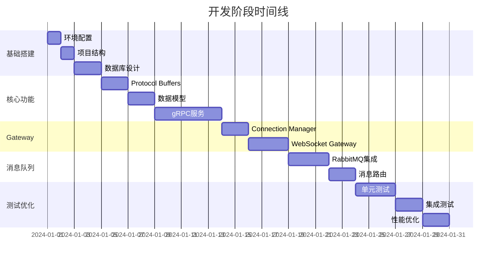

# Beehive IM 系统完整开发指南

## 概述

本文档提供从零开始构建 Beehive IM 系统的完整开发指南，包含每个阶段的详细步骤、代码示例和检查点。

## 微服务架构

Beehive IM 系统采用微服务架构，使用独立的 Auth Service 负责认证授权，包含以下微服务：

### 微服务划分



### 微服务职责

#### 1. Gateway 服务
- **职责**：WebSocket 连接管理、消息路由、客户端通信
- **端口**：8080 (HTTP/WebSocket)
- **技术**：gorilla/websocket, gRPC Client
- **特点**：无状态，可水平扩展

#### 2. Auth Service
- **职责**：用户登录、认证、JWT Token 生成和验证、权限验证
- **端口**：50050 (gRPC)
- **技术**：gRPC Server, JWT, Redis
- **数据**：Redis（Token 缓存、黑名单）

#### 3. User Service
- **职责**：用户注册、用户信息管理
- **端口**：50051 (gRPC)
- **技术**：gRPC Server, GORM
- **数据**：users 表

#### 4. Message Service
- **职责**：消息发送、消息历史、未读消息、消息状态管理
- **端口**：50052 (gRPC)
- **技术**：gRPC Server, RabbitMQ Producer, GORM
- **数据**：messages, conversations 表

#### 5. Presence Service
- **职责**：在线状态管理、用户上线/下线通知
- **端口**：50053 (gRPC)
- **技术**：gRPC Server, Redis
- **数据**：Redis (在线状态缓存)

## 开发阶段概览



## 阶段一：项目基础搭建（第1-4天）

### 1.1 环境准备

#### 1.1.1 安装必要工具

```bash
# 检查 Go 版本（需要 1.21+）
go version

# 安装 Protocol Buffers 编译器
# macOS
brew install protobuf

# Linux
sudo apt-get install protobuf-compiler

# 安装 Go 插件
go install google.golang.org/protobuf/cmd/protoc-gen-go@latest
go install google.golang.org/grpc/cmd/protoc-gen-go-grpc@latest
```

#### 1.1.2 创建项目结构

```bash
cd /opt/Beehive

# 创建目录结构
mkdir -p pkg/api/proto/{auth,user,message,presence}/v1
mkdir -p cmd/{gateway,auth-service,user-service,message-service,presence-service}
mkdir -p internal/{gateway/{websocket,connection},service/{auth,user,message,presence},mq,pkg/{model,db,config,utils}}
mkdir -p pkg/{options,utils}
mkdir -p pkg/api/{user,message,group}/v1
mkdir -p scripts
mkdir -p docker
mkdir -p docs/dev
mkdir -p configs
```

**项目结构说明：**

```
Beehive/
├── pkg/
│   ├── api/
│   │   ├── proto/                    # Protocol Buffers 定义文件
│   │   │   ├── auth/v1/
│   │   │   ├── user/v1/
│   │   │   ├── message/v1/
│   │   │   └── presence/v1/
│   │   ├── user/v1/                  # User 数据模型
│   │   ├── message/v1/               # Message 数据模型
│   │   └── group/v1/                 # Group 数据模型
│   ├── options/                      # 命令行选项（Cobra）
│   └── utils/                        # 工具函数
├── cmd/                              # 微服务入口（Cobra 命令）
│   ├── gateway/                      # Gateway 服务
│   ├── auth-service/                 # Auth Service
│   ├── user-service/                 # User Service
│   ├── message-service/              # Message Service
│   └── presence-service/             # Presence Service
├── internal/                         # 内部实现（不对外暴露）
│   ├── gateway/                      # Gateway 服务实现
│   ├── service/                      # gRPC 服务实现
│   │   ├── auth/                     # Auth Service 实现
│   │   ├── user/                     # User Service 实现
│   │   ├── message/                  # Message Service 实现
│   │   └── presence/                 # Presence Service 实现
│   ├── mq/                           # 消息队列
│   └── pkg/                          # 内部共享包
├── configs/                          # 配置文件目录
├── scripts/                          # 脚本文件
├── docker/                           # Docker 配置
└── docs/                              # 文档
```

### 1.2 Docker 环境配置

#### 1.2.1 创建 docker-compose.yml

```yaml
# docker/docker-compose.yml
version: '3.8'

services:
  postgres:
    image: postgres:15-alpine
    container_name: beehive-postgres
    environment:
      POSTGRES_USER: postgres
      POSTGRES_PASSWORD: postgres
      POSTGRES_DB: beehive
    ports:
      - "5432:5432"
    volumes:
      - postgres_data:/var/lib/postgresql/data

  rabbitmq:
    image: rabbitmq:3-management-alpine
    container_name: beehive-rabbitmq
    environment:
      RABBITMQ_DEFAULT_USER: guest
      RABBITMQ_DEFAULT_PASS: guest
    ports:
      - "5672:5672"   # AMQP 端口
      - "15672:15672" # 管理界面
    volumes:
      - rabbitmq_data:/var/lib/rabbitmq

  redis:
    image: redis:7-alpine
    container_name: beehive-redis
    ports:
      - "6379:6379"
    volumes:
      - redis_data:/data

volumes:
  postgres_data:
  rabbitmq_data:
  redis_data:
```

## 阶段二：Protocol Buffers 定义（第5-6天）

### 2.1 生成 Go 代码

```bash
# 创建生成脚本
# scripts/generate-proto.sh
#!/bin/bash

PROTO_DIR="pkg/api/proto"
OUTPUT_DIR="pkg/api/proto"

# 生成 Auth Service
protoc --go_out=${OUTPUT_DIR}/auth/v1 \
       --go_opt=paths=source_relative \
       --go-grpc_out=${OUTPUT_DIR}/auth/v1 \
       --go-grpc_opt=paths=source_relative \
       ${PROTO_DIR}/auth/v1/auth.proto

# 生成 User Service
protoc --go_out=${OUTPUT_DIR}/user/v1 \
       --go_opt=paths=source_relative \
       --go-grpc_out=${OUTPUT_DIR}/user/v1 \
       --go-grpc_opt=paths=source_relative \
       ${PROTO_DIR}/user/v1/user.proto

# 生成 Message Service
protoc --go_out=${OUTPUT_DIR}/message/v1 \
       --go_opt=paths=source_relative \
       --go-grpc_out=${OUTPUT_DIR}/message/v1 \
       --go-grpc_opt=paths=source_relative \
       ${PROTO_DIR}/message/v1/message.proto

# 生成 Presence Service
protoc --go_out=${OUTPUT_DIR}/presence/v1 \
       --go_opt=paths=source_relative \
       --go-grpc_out=${OUTPUT_DIR}/presence/v1 \
       --go-grpc_opt=paths=source_relative \
       ${PROTO_DIR}/presence/v1/presence.proto

echo "Proto files generated successfully!"
```

```bash
chmod +x scripts/generate-proto.sh
./scripts/generate-proto.sh
```

## 阶段三：gRPC 服务实现（第7-11天）

### 3.1 Auth Service 实现

参考 [Auth 认证架构设计](./02-Auth认证架构设计.md) 文档实现。

### 3.2 User Service 实现

参考 [微服务架构设计](./00-微服务架构设计.md) 文档实现。

### 3.3 Message Service 实现

参考 [消息队列设计](./03-消息队列设计.md) 文档实现。

### 3.4 Presence Service 实现

参考 [微服务架构设计](./00-微服务架构设计.md) 文档实现。

## 阶段四：WebSocket Gateway（第12-16天）

### 4.1 Gateway Service 入口

参考 [用户登录与操作逻辑](./01-用户登录与操作逻辑.md) 文档实现。

## 阶段五：RabbitMQ 集成（第17-21天）

### 5.1 Producer 实现

参考 [消息队列设计](./03-消息队列设计.md) 文档实现。

### 5.2 Consumer 实现

参考 [消息队列设计](./03-消息队列设计.md) 文档实现。

## 阶段六：测试和优化（第22-30天）

### 6.1 单元测试

为每个服务编写单元测试。

### 6.2 集成测试

编写端到端的集成测试。

### 6.3 性能优化

优化性能瓶颈，添加缓存和连接池。

## 每日开发检查清单

### 第1天：环境搭建
- [ ] Go 环境配置
- [ ] Docker 环境配置
- [ ] 项目结构创建
- [ ] 依赖安装

### 第2天：配置和数据库
- [ ] 配置文件实现
- [ ] 数据库表设计
- [ ] 数据模型实现
- [ ] 数据库连接测试

### 第3-4天：Protocol Buffers
- [ ] Proto 文件定义
- [ ] 代码生成
- [ ] 验证生成代码

### 第5-9天：gRPC 服务
- [ ] Auth Service 实现
- [ ] User Service 实现
- [ ] Message Service 实现
- [ ] Presence Service 实现
- [ ] 服务测试

### 第10-13天：WebSocket Gateway
- [ ] Connection Manager
- [ ] WebSocket Handler
- [ ] 消息处理逻辑
- [ ] 集成测试

### 第14-16天：RabbitMQ
- [ ] Producer 实现
- [ ] Consumer 实现
- [ ] Exchange 和 Queue 配置
- [ ] 消息路由测试

### 第17-20天：功能完善
- [ ] 离线消息处理
- [ ] 群聊功能
- [ ] 在线状态
- [ ] 错误处理

### 第21-25天：测试和优化
- [ ] 单元测试
- [ ] 集成测试
- [ ] 性能优化
- [ ] 文档完善

## 常见问题排查

### 问题1：数据库连接失败
- 检查 Docker 容器是否运行
- 检查连接配置
- 检查网络端口

### 问题2：gRPC 服务启动失败
- 检查端口是否被占用
- 检查 proto 文件是否正确生成
- 检查依赖是否正确安装

### 问题3：RabbitMQ 连接失败
- 检查 RabbitMQ 容器状态
- 检查连接 URL
- 检查 Exchange 和 Queue 是否创建

### 问题4：Token 验证失败
- 检查 JWT Secret 配置
- 检查 Redis 连接
- 检查 Token 是否过期

## 下一步

完成基础功能后，可以考虑：
1. 添加文件上传功能
2. 实现消息撤回
3. 添加消息搜索
4. 实现消息加密
5. 添加管理后台
6. 实现分布式部署

## 参考文档

- [微服务架构设计](./00-微服务架构设计.md)
- [用户登录与操作逻辑](./01-用户登录与操作逻辑.md)
- [Auth 认证架构设计](./02-Auth认证架构设计.md)
- [消息队列设计](./03-消息队列设计.md)
