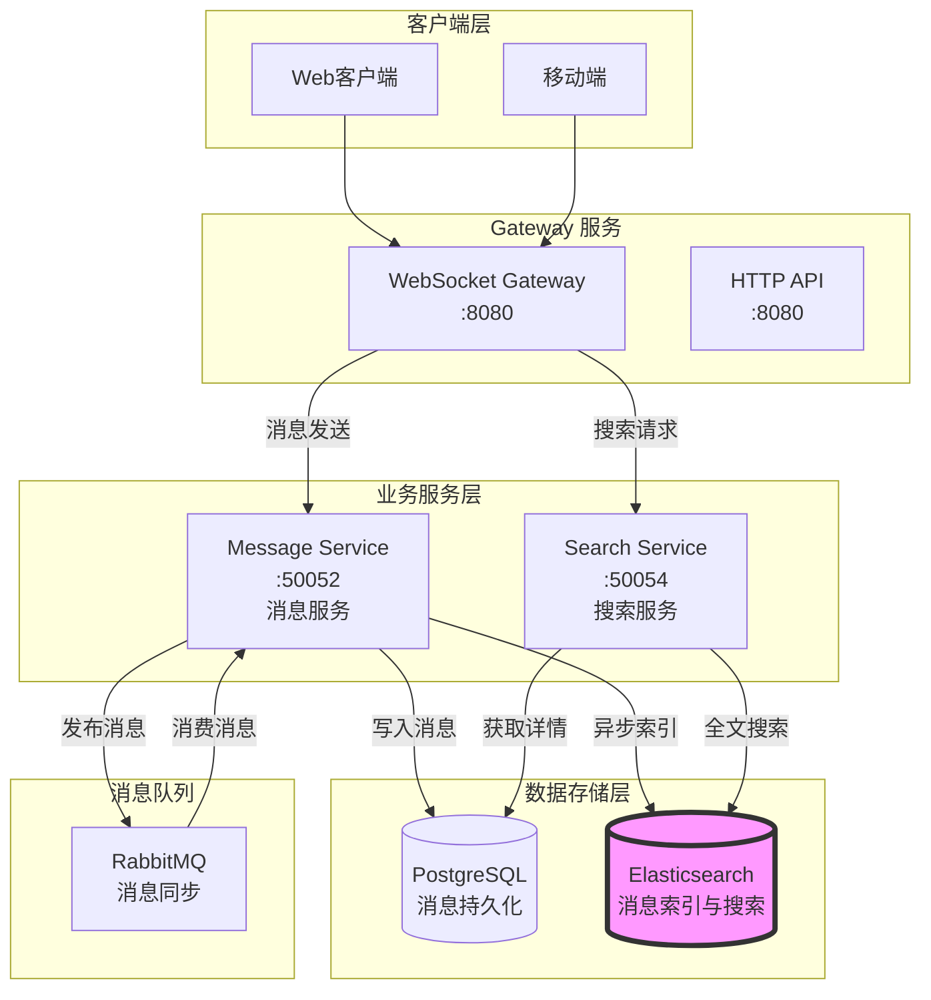
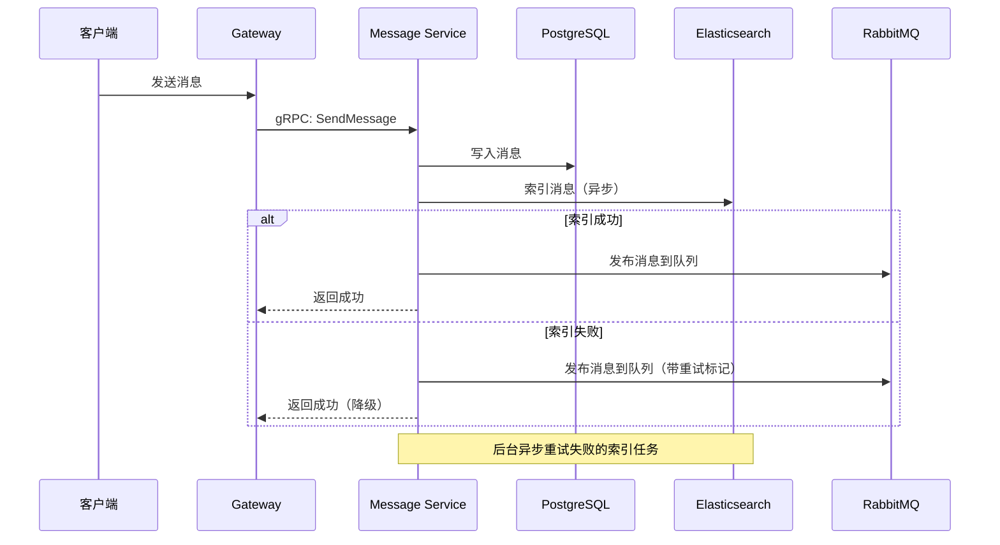

# Elasticsearch 搜索架构设计

## 概述

Beehive IM 系统使用 Elasticsearch 实现消息历史的全文检索功能，支持单聊消息、群聊消息的快速搜索。本文档详细说明 Elasticsearch 的架构设计、索引设计、搜索策略和集成方案。

## 架构图



## 为什么需要 Elasticsearch

### 1. PostgreSQL 的局限性

**全文搜索性能问题**：
- PostgreSQL 的 `LIKE '%keyword%'` 查询无法使用索引，在海量消息中性能极差
- PostgreSQL 的全文搜索（`tsvector`）对中文支持不佳，需要额外的分词插件
- 复杂的多字段搜索需求难以优化

**示例场景**：
```sql
-- 在 1000万+ 消息中搜索，性能极差
SELECT * FROM messages 
WHERE content LIKE '%关键词%' 
ORDER BY created_at DESC 
LIMIT 20;
```

### 2. Elasticsearch 的优势

**高性能全文搜索**：
- 倒排索引，搜索速度快（毫秒级）
- 支持中文分词（IK Analyzer）
- 支持复杂的搜索查询（多字段、模糊搜索、高亮显示）

**分布式架构**：
- 水平扩展能力强
- 支持海量数据存储和检索

**丰富的搜索功能**：
- 相关性评分
- 搜索结果高亮
- 聚合分析（统计消息数量、时间分布等）

## 索引设计

### 1. 消息索引 (messages)

**索引名称**：`beehive-messages`

**Mapping 定义**：

```json
{
  "settings": {
    "number_of_shards": 3,
    "number_of_replicas": 1,
    "analysis": {
      "analyzer": {
        "ik_max_word_analyzer": {
          "type": "custom",
          "tokenizer": "ik_max_word"
        },
        "ik_smart_analyzer": {
          "type": "custom",
          "tokenizer": "ik_smart"
        }
      }
    }
  },
  "mappings": {
    "properties": {
      "message_id": {
        "type": "keyword"
      },
      "type": {
        "type": "keyword"
      },
      "from_id": {
        "type": "keyword"
      },
      "to_id": {
        "type": "keyword"
      },
      "group_id": {
        "type": "keyword"
      },
      "content": {
        "type": "text",
        "analyzer": "ik_max_word_analyzer",
        "search_analyzer": "ik_smart_analyzer",
        "fields": {
          "keyword": {
            "type": "keyword",
            "ignore_above": 256
          }
        }
      },
      "message_type": {
        "type": "keyword"
      },
      "status": {
        "type": "keyword"
      },
      "created_at": {
        "type": "date",
        "format": "epoch_second"
      },
      "updated_at": {
        "type": "date",
        "format": "epoch_second"
      }
    }
  }
}
```

**字段说明**：

| 字段 | 类型 | 说明 | 索引方式 |
|------|------|------|----------|
| message_id | keyword | 消息ID | 精确匹配 |
| type | keyword | 消息类型（single/group） | 精确匹配 |
| from_id | keyword | 发送者ID | 精确匹配 |
| to_id | keyword | 接收者ID（单聊） | 精确匹配 |
| group_id | keyword | 群组ID（群聊） | 精确匹配 |
| content | text | 消息内容 | 全文搜索（IK分词） |
| message_type | keyword | 消息类型（text/image/file） | 精确匹配 |
| status | keyword | 消息状态 | 精确匹配 |
| created_at | date | 创建时间 | 时间范围查询 |
| updated_at | date | 更新时间 | 时间范围查询 |

### 2. 索引分词器

**IK Analyzer 中文分词器**：

- **ik_max_word**：索引时使用，细粒度切分，穷尽所有可能的组合
  - 例如："中华人民共和国" → "中华人民共和国", "中华人民", "中华", "华人", "人民共和国", "人民", "共和国"

- **ik_smart**：搜索时使用，粗粒度切分，最少切分
  - 例如："中华人民共和国" → "中华人民共和国"

**为什么使用不同的分词器**：
- 索引时细粒度切分，确保所有可能的搜索词都能匹配
- 搜索时粗粒度切分，提高搜索精度，减少噪音

## 数据同步策略

### 1. 实时同步（推荐）

**流程**：



**实现代码**：

```go
// internal/beehive-message/service/service.go
func (s *Service) SendMessage(ctx context.Context, req *pb.SendMessageRequest) (*pb.SendMessageResponse, error) {
    // 1. 保存消息到数据库
    message := &model.Message{
        ID:          id.GenID(),
        Type:        "single",
        FromID:      req.FromId,
        ToID:        req.ToId,
        Content:     req.Content,
        MessageType: req.MessageType,
        Status:      "sent",
        CreatedAt:   time.Now(),
        UpdatedAt:   time.Now(),
    }
    
    if err := s.store.CreateMessage(ctx, message); err != nil {
        return nil, err
    }
    
    // 2. 异步索引到 Elasticsearch
    go func() {
        if err := s.esClient.IndexMessage(context.Background(), message); err != nil {
            log.Printf("Failed to index message to ES: %v", err)
            // 将失败的索引任务加入重试队列
            s.retryQueue.Add(message.ID)
        }
    }()
    
    // 3. 发布到 RabbitMQ
    if err := s.producer.PublishSingleChatMessage(req.ToId, message); err != nil {
        return nil, err
    }
    
    return &pb.SendMessageResponse{
        MessageId: message.ID,
        CreatedAt: message.CreatedAt.Unix(),
    }, nil
}
```

### 2. 批量同步（数据迁移）

**使用场景**：
- 初次集成 Elasticsearch，需要同步历史数据
- Elasticsearch 数据丢失，需要重建索引

**实现方式**：

```bash
# 批量同步脚本
# scripts/sync-messages-to-es.sh
#!/bin/bash

# 从 PostgreSQL 批量读取消息
# 每次读取 1000 条
# 使用 Bulk API 批量索引到 Elasticsearch

go run cmd/tools/sync-to-es/main.go \
  --batch-size 1000 \
  --workers 10 \
  --start-date "2024-01-01" \
  --end-date "2024-12-31"
```

**批量同步代码**：

```go
// cmd/tools/sync-to-es/main.go
func main() {
    // 1. 连接数据库
    db := connectDB()
    
    // 2. 连接 Elasticsearch
    esClient := connectES()
    
    // 3. 分页查询消息
    offset := 0
    batchSize := 1000
    
    for {
        messages, err := db.GetMessages(offset, batchSize)
        if err != nil {
            log.Fatal(err)
        }
        
        if len(messages) == 0 {
            break
        }
        
        // 4. 批量索引到 Elasticsearch
        if err := esClient.BulkIndexMessages(messages); err != nil {
            log.Printf("Failed to bulk index: %v", err)
        }
        
        offset += batchSize
        log.Printf("Synced %d messages", offset)
    }
    
    log.Println("Sync completed!")
}
```

## 搜索服务设计

### 1. Search Service (新增微服务)

**职责**：
- 提供消息全文搜索功能
- 封装 Elasticsearch 查询逻辑
- 结合 PostgreSQL 获取完整消息详情

**端口**：50054 (gRPC)

**技术栈**：
- gRPC Server
- Elasticsearch Go Client
- GORM (可选，用于获取消息详情)
- etcd (服务注册)

### 2. Proto 定义

```protobuf
// pkg/api/proto/search/v1/search.proto
syntax = "proto3";

package search.v1;

option go_package = "github.com/HappyLadySauce/Beehive/pkg/api/proto/search/v1";

service SearchService {
    // SearchMessages 搜索消息
    rpc SearchMessages(SearchMessagesRequest) returns (SearchMessagesResponse);
    
    // SearchUserMessages 搜索用户之间的消息
    rpc SearchUserMessages(SearchUserMessagesRequest) returns (SearchUserMessagesResponse);
    
    // SearchGroupMessages 搜索群组消息
    rpc SearchGroupMessages(SearchGroupMessagesRequest) returns (SearchGroupMessagesResponse);
}

message SearchMessagesRequest {
    string user_id = 1;        // 当前用户ID
    string keyword = 2;        // 搜索关键词
    string message_type = 3;   // 消息类型过滤（可选）
    int64 start_time = 4;      // 开始时间（Unix时间戳，可选）
    int64 end_time = 5;        // 结束时间（Unix时间戳，可选）
    int32 limit = 6;           // 每页数量，默认 20
    int32 offset = 7;          // 偏移量，默认 0
}

message SearchMessagesResponse {
    repeated Message messages = 1;  // 消息列表
    int32 total = 2;                // 总数量
    repeated string highlights = 3; // 高亮片段
}

message SearchUserMessagesRequest {
    string user_id = 1;        // 当前用户ID
    string target_user_id = 2; // 目标用户ID
    string keyword = 3;        // 搜索关键词
    int32 limit = 4;           // 每页数量
    int32 offset = 5;          // 偏移量
}

message SearchUserMessagesResponse {
    repeated Message messages = 1;
    int32 total = 2;
}

message SearchGroupMessagesRequest {
    string group_id = 1;       // 群组ID
    string keyword = 2;        // 搜索关键词
    int32 limit = 3;           // 每页数量
    int32 offset = 4;          // 偏移量
}

message SearchGroupMessagesResponse {
    repeated Message messages = 1;
    int32 total = 2;
}

message Message {
    string id = 1;
    string type = 2;
    string from_id = 3;
    string to_id = 4;
    string group_id = 5;
    string content = 6;
    string message_type = 7;
    string status = 8;
    int64 created_at = 9;
    int64 updated_at = 10;
}
```

### 3. 搜索查询实现

```go
// internal/beehive-search/service/service.go
package service

import (
    "context"
    "encoding/json"
    "github.com/elastic/go-elasticsearch/v8"
    "github.com/elastic/go-elasticsearch/v8/esapi"
)

type Service struct {
    esClient *elasticsearch.Client
}

// SearchMessages 搜索消息
func (s *Service) SearchMessages(ctx context.Context, req *pb.SearchMessagesRequest) (*pb.SearchMessagesResponse, error) {
    // 构建 Elasticsearch 查询
    query := map[string]interface{}{
        "query": map[string]interface{}{
            "bool": map[string]interface{}{
                "must": []interface{}{
                    // 关键词搜索（content 字段）
                    map[string]interface{}{
                        "match": map[string]interface{}{
                            "content": req.Keyword,
                        },
                    },
                    // 用户相关消息（发送或接收）
                    map[string]interface{}{
                        "bool": map[string]interface{}{
                            "should": []interface{}{
                                map[string]interface{}{
                                    "term": map[string]interface{}{
                                        "from_id": req.UserId,
                                    },
                                },
                                map[string]interface{}{
                                    "term": map[string]interface{}{
                                        "to_id": req.UserId,
                                    },
                                },
                            },
                            "minimum_should_match": 1,
                        },
                    },
                },
            },
        },
        "from": req.Offset,
        "size": req.Limit,
        "sort": []interface{}{
            map[string]interface{}{
                "created_at": map[string]string{
                    "order": "desc",
                },
            },
        },
        "highlight": map[string]interface{}{
            "fields": map[string]interface{}{
                "content": map[string]interface{}{
                    "pre_tags":  []string{"<em>"},
                    "post_tags": []string{"</em>"},
                },
            },
        },
    }
    
    // 添加消息类型过滤
    if req.MessageType != "" {
        query["query"].(map[string]interface{})["bool"].(map[string]interface{})["must"] = append(
            query["query"].(map[string]interface{})["bool"].(map[string]interface{})["must"].([]interface{}),
            map[string]interface{}{
                "term": map[string]interface{}{
                    "message_type": req.MessageType,
                },
            },
        )
    }
    
    // 添加时间范围过滤
    if req.StartTime > 0 || req.EndTime > 0 {
        rangeQuery := map[string]interface{}{
            "range": map[string]interface{}{
                "created_at": map[string]interface{}{},
            },
        }
        
        if req.StartTime > 0 {
            rangeQuery["range"].(map[string]interface{})["created_at"].(map[string]interface{})["gte"] = req.StartTime
        }
        
        if req.EndTime > 0 {
            rangeQuery["range"].(map[string]interface{})["created_at"].(map[string]interface{})["lte"] = req.EndTime
        }
        
        query["query"].(map[string]interface{})["bool"].(map[string]interface{})["must"] = append(
            query["query"].(map[string]interface{})["bool"].(map[string]interface{})["must"].([]interface{}),
            rangeQuery,
        )
    }
    
    // 执行搜索
    var buf bytes.Buffer
    if err := json.NewEncoder(&buf).Encode(query); err != nil {
        return nil, err
    }
    
    res, err := s.esClient.Search(
        s.esClient.Search.WithContext(ctx),
        s.esClient.Search.WithIndex("beehive-messages"),
        s.esClient.Search.WithBody(&buf),
    )
    if err != nil {
        return nil, err
    }
    defer res.Body.Close()
    
    // 解析搜索结果
    var result map[string]interface{}
    if err := json.NewDecoder(res.Body).Decode(&result); err != nil {
        return nil, err
    }
    
    // 提取消息列表
    hits := result["hits"].(map[string]interface{})["hits"].([]interface{})
    total := int32(result["hits"].(map[string]interface{})["total"].(map[string]interface{})["value"].(float64))
    
    messages := make([]*pb.Message, 0, len(hits))
    highlights := make([]string, 0, len(hits))
    
    for _, hit := range hits {
        source := hit.(map[string]interface{})["_source"].(map[string]interface{})
        
        message := &pb.Message{
            Id:          source["message_id"].(string),
            Type:        source["type"].(string),
            FromId:      source["from_id"].(string),
            Content:     source["content"].(string),
            MessageType: source["message_type"].(string),
            Status:      source["status"].(string),
            CreatedAt:   int64(source["created_at"].(float64)),
            UpdatedAt:   int64(source["updated_at"].(float64)),
        }
        
        // 处理可选字段
        if toID, ok := source["to_id"].(string); ok {
            message.ToId = toID
        }
        if groupID, ok := source["group_id"].(string); ok {
            message.GroupId = groupID
        }
        
        messages = append(messages, message)
        
        // 提取高亮片段
        if highlight, ok := hit.(map[string]interface{})["highlight"].(map[string]interface{}); ok {
            if contentHighlight, ok := highlight["content"].([]interface{}); ok && len(contentHighlight) > 0 {
                highlights = append(highlights, contentHighlight[0].(string))
            }
        }
    }
    
    return &pb.SearchMessagesResponse{
        Messages:   messages,
        Total:      total,
        Highlights: highlights,
    }, nil
}

// SearchUserMessages 搜索用户之间的消息
func (s *Service) SearchUserMessages(ctx context.Context, req *pb.SearchUserMessagesRequest) (*pb.SearchUserMessagesResponse, error) {
    query := map[string]interface{}{
        "query": map[string]interface{}{
            "bool": map[string]interface{}{
                "must": []interface{}{
                    map[string]interface{}{
                        "match": map[string]interface{}{
                            "content": req.Keyword,
                        },
                    },
                    map[string]interface{}{
                        "bool": map[string]interface{}{
                            "should": []interface{}{
                                // user_id -> target_user_id
                                map[string]interface{}{
                                    "bool": map[string]interface{}{
                                        "must": []interface{}{
                                            map[string]interface{}{
                                                "term": map[string]interface{}{"from_id": req.UserId},
                                            },
                                            map[string]interface{}{
                                                "term": map[string]interface{}{"to_id": req.TargetUserId},
                                            },
                                        },
                                    },
                                },
                                // target_user_id -> user_id
                                map[string]interface{}{
                                    "bool": map[string]interface{}{
                                        "must": []interface{}{
                                            map[string]interface{}{
                                                "term": map[string]interface{}{"from_id": req.TargetUserId},
                                            },
                                            map[string]interface{}{
                                                "term": map[string]interface{}{"to_id": req.UserId},
                                            },
                                        },
                                    },
                                },
                            },
                            "minimum_should_match": 1,
                        },
                    },
                },
            },
        },
        "from": req.Offset,
        "size": req.Limit,
        "sort": []interface{}{
            map[string]interface{}{
                "created_at": map[string]string{"order": "desc"},
            },
        },
    }
    
    // 执行搜索（与 SearchMessages 类似）
    // ...省略重复代码
    
    return &pb.SearchUserMessagesResponse{
        Messages: messages,
        Total:    total,
    }, nil
}

// SearchGroupMessages 搜索群组消息
func (s *Service) SearchGroupMessages(ctx context.Context, req *pb.SearchGroupMessagesRequest) (*pb.SearchGroupMessagesResponse, error) {
    query := map[string]interface{}{
        "query": map[string]interface{}{
            "bool": map[string]interface{}{
                "must": []interface{}{
                    map[string]interface{}{
                        "match": map[string]interface{}{
                            "content": req.Keyword,
                        },
                    },
                    map[string]interface{}{
                        "term": map[string]interface{}{
                            "group_id": req.GroupId,
                        },
                    },
                },
            },
        },
        "from": req.Offset,
        "size": req.Limit,
        "sort": []interface{}{
            map[string]interface{}{
                "created_at": map[string]string{"order": "desc"},
            },
        },
    }
    
    // 执行搜索（与 SearchMessages 类似）
    // ...省略重复代码
    
    return &pb.SearchGroupMessagesResponse{
        Messages: messages,
        Total:    total,
    }, nil
}
```

## Elasticsearch 客户端封装

### 1. 客户端初始化

```go
// internal/pkg/elasticsearch/client.go
package elasticsearch

import (
    "github.com/elastic/go-elasticsearch/v8"
)

type Client struct {
    es *elasticsearch.Client
}

func NewClient(addresses []string) (*Client, error) {
    cfg := elasticsearch.Config{
        Addresses: addresses,
    }
    
    es, err := elasticsearch.NewClient(cfg)
    if err != nil {
        return nil, err
    }
    
    // 测试连接
    res, err := es.Info()
    if err != nil {
        return nil, err
    }
    defer res.Body.Close()
    
    return &Client{es: es}, nil
}

// IndexMessage 索引消息
func (c *Client) IndexMessage(ctx context.Context, message *model.Message) error {
    doc := map[string]interface{}{
        "message_id":   message.ID,
        "type":         message.Type,
        "from_id":      message.FromID,
        "to_id":        message.ToID,
        "group_id":     message.GroupID,
        "content":      message.Content,
        "message_type": message.MessageType,
        "status":       message.Status,
        "created_at":   message.CreatedAt.Unix(),
        "updated_at":   message.UpdatedAt.Unix(),
    }
    
    var buf bytes.Buffer
    if err := json.NewEncoder(&buf).Encode(doc); err != nil {
        return err
    }
    
    req := esapi.IndexRequest{
        Index:      "beehive-messages",
        DocumentID: message.ID,
        Body:       &buf,
        Refresh:    "true",
    }
    
    res, err := req.Do(ctx, c.es)
    if err != nil {
        return err
    }
    defer res.Body.Close()
    
    if res.IsError() {
        return fmt.Errorf("error indexing document: %s", res.String())
    }
    
    return nil
}

// BulkIndexMessages 批量索引消息
func (c *Client) BulkIndexMessages(ctx context.Context, messages []*model.Message) error {
    var buf bytes.Buffer
    
    for _, message := range messages {
        // Bulk API 格式：{ "index": { "_id": "1" } }
        meta := map[string]interface{}{
            "index": map[string]interface{}{
                "_index": "beehive-messages",
                "_id":    message.ID,
            },
        }
        if err := json.NewEncoder(&buf).Encode(meta); err != nil {
            return err
        }
        
        // 文档数据
        doc := map[string]interface{}{
            "message_id":   message.ID,
            "type":         message.Type,
            "from_id":      message.FromID,
            "to_id":        message.ToID,
            "group_id":     message.GroupID,
            "content":      message.Content,
            "message_type": message.MessageType,
            "status":       message.Status,
            "created_at":   message.CreatedAt.Unix(),
            "updated_at":   message.UpdatedAt.Unix(),
        }
        if err := json.NewEncoder(&buf).Encode(doc); err != nil {
            return err
        }
    }
    
    res, err := c.es.Bulk(&buf)
    if err != nil {
        return err
    }
    defer res.Body.Close()
    
    if res.IsError() {
        return fmt.Errorf("bulk indexing failed: %s", res.String())
    }
    
    return nil
}

// CreateIndex 创建索引
func (c *Client) CreateIndex(ctx context.Context) error {
    mapping := `{
        "settings": {
            "number_of_shards": 3,
            "number_of_replicas": 1,
            "analysis": {
                "analyzer": {
                    "ik_max_word_analyzer": {
                        "type": "custom",
                        "tokenizer": "ik_max_word"
                    },
                    "ik_smart_analyzer": {
                        "type": "custom",
                        "tokenizer": "ik_smart"
                    }
                }
            }
        },
        "mappings": {
            "properties": {
                "message_id": { "type": "keyword" },
                "type": { "type": "keyword" },
                "from_id": { "type": "keyword" },
                "to_id": { "type": "keyword" },
                "group_id": { "type": "keyword" },
                "content": {
                    "type": "text",
                    "analyzer": "ik_max_word_analyzer",
                    "search_analyzer": "ik_smart_analyzer",
                    "fields": {
                        "keyword": {
                            "type": "keyword",
                            "ignore_above": 256
                        }
                    }
                },
                "message_type": { "type": "keyword" },
                "status": { "type": "keyword" },
                "created_at": {
                    "type": "date",
                    "format": "epoch_second"
                },
                "updated_at": {
                    "type": "date",
                    "format": "epoch_second"
                }
            }
        }
    }`
    
    res, err := c.es.Indices.Create(
        "beehive-messages",
        c.es.Indices.Create.WithBody(strings.NewReader(mapping)),
    )
    if err != nil {
        return err
    }
    defer res.Body.Close()
    
    if res.IsError() {
        return fmt.Errorf("error creating index: %s", res.String())
    }
    
    return nil
}
```

## 部署配置

### 1. Docker Compose 配置

```yaml
# docker/docker-compose.yml
version: '3.8'

services:
  elasticsearch:
    image: docker.elastic.co/elasticsearch/elasticsearch:8.11.0
    container_name: beehive-elasticsearch
    environment:
      - discovery.type=single-node
      - xpack.security.enabled=false
      - "ES_JAVA_OPTS=-Xms512m -Xmx512m"
    ports:
      - "9200:9200"
      - "9300:9300"
    volumes:
      - es_data:/usr/share/elasticsearch/data
    networks:
      - beehive

  kibana:
    image: docker.elastic.co/kibana/kibana:8.11.0
    container_name: beehive-kibana
    environment:
      - ELASTICSEARCH_HOSTS=http://elasticsearch:9200
    ports:
      - "5601:5601"
    depends_on:
      - elasticsearch
    networks:
      - beehive

volumes:
  es_data:

networks:
  beehive:
    driver: bridge
```

### 2. 服务配置

```yaml
# configs/search-service.yaml
grpc:
  bind-address: "0.0.0.0"
  bind-port: 50054

elasticsearch:
  addresses:
    - http://localhost:9200
  index: beehive-messages

etcd:
  endpoints:
    - localhost:2379
  dial-timeout: 5s
  prefix: "/beehive/services"

log:
  level: info
  format: json
```

```yaml
# configs/message-service.yaml
# ... 现有配置 ...

elasticsearch:
  addresses:
    - http://localhost:9200
  index: beehive-messages
  sync_enabled: true  # 启用同步到 Elasticsearch
```

## 性能优化

### 1. 批量索引

**问题**：单条索引性能低，大量消息时会成为瓶颈

**解决方案**：使用 Bulk API 批量索引

```go
// 使用缓冲区，每 100 条消息批量索引一次
type BulkIndexer struct {
    client *elasticsearch.Client
    buffer []*model.Message
    size   int
    mu     sync.Mutex
}

func (b *BulkIndexer) Add(message *model.Message) {
    b.mu.Lock()
    defer b.mu.Unlock()
    
    b.buffer = append(b.buffer, message)
    
    if len(b.buffer) >= b.size {
        b.Flush()
    }
}

func (b *BulkIndexer) Flush() {
    if len(b.buffer) == 0 {
        return
    }
    
    if err := b.client.BulkIndexMessages(context.Background(), b.buffer); err != nil {
        log.Printf("Bulk index failed: %v", err)
    }
    
    b.buffer = b.buffer[:0]
}
```

### 2. 异步索引

**问题**：同步索引会阻塞消息发送，影响用户体验

**解决方案**：使用 Goroutine 异步索引

```go
// 使用 worker pool 异步索引
type AsyncIndexer struct {
    queue chan *model.Message
}

func NewAsyncIndexer(workers int) *AsyncIndexer {
    indexer := &AsyncIndexer{
        queue: make(chan *model.Message, 1000),
    }
    
    for i := 0; i < workers; i++ {
        go indexer.worker()
    }
    
    return indexer
}

func (a *AsyncIndexer) worker() {
    for message := range a.queue {
        if err := esClient.IndexMessage(context.Background(), message); err != nil {
            log.Printf("Index failed: %v", err)
        }
    }
}

func (a *AsyncIndexer) Index(message *model.Message) {
    select {
    case a.queue <- message:
    default:
        log.Println("Index queue full, dropping message")
    }
}
```

### 3. 索引优化

**分片和副本配置**：
- 生产环境：3 个主分片，1 个副本（可根据数据量调整）
- 开发环境：1 个主分片，0 个副本

**Refresh Interval**：
- 默认 1 秒刷新一次，可以调整为 5 秒或 10 秒，提高索引性能

```json
{
  "settings": {
    "refresh_interval": "5s"
  }
}
```

## 监控和运维

### 1. 监控指标

**Elasticsearch 指标**：
- 集群健康状态（green/yellow/red）
- 索引大小
- 索引速率
- 搜索延迟
- 搜索 QPS

**使用 Kibana 监控**：
- 访问 http://localhost:5601
- 查看集群健康状态
- 分析搜索性能

### 2. 索引生命周期管理（ILM）

**策略**：
- Hot 阶段：最近 30 天的消息，存储在 SSD
- Warm 阶段：30-90 天的消息，存储在 HDD
- Cold 阶段：90-365 天的消息，压缩存储
- Delete 阶段：超过 365 天的消息，自动删除

### 3. 备份和恢复

**快照备份**：
```bash
# 创建快照仓库
PUT /_snapshot/my_backup
{
  "type": "fs",
  "settings": {
    "location": "/mount/backups/my_backup"
  }
}

# 创建快照
PUT /_snapshot/my_backup/snapshot_1

# 恢复快照
POST /_snapshot/my_backup/snapshot_1/_restore
```

## 常见问题

### Q1: Elasticsearch 和 PostgreSQL 数据不一致怎么办？

**A**: 
- 以 PostgreSQL 为主数据源，Elasticsearch 作为搜索引擎
- Elasticsearch 数据丢失可以通过批量同步脚本重建
- 定期检查数据一致性

### Q2: 搜索性能不佳怎么优化？

**A**:
- 检查分片数量，过多或过少都会影响性能
- 使用 `_search` API 的 `profile` 参数分析慢查询
- 优化查询语句，避免使用 wildcard 和 regexp
- 增加硬件资源（CPU、内存、磁盘 IO）

### Q3: 如何处理中文分词？

**A**:
- 使用 IK Analyzer 插件
- 安装方式：`elasticsearch-plugin install https://github.com/medcl/elasticsearch-analysis-ik/releases/download/v8.11.0/elasticsearch-analysis-ik-8.11.0.zip`
- 配置自定义词典（扩展词、停用词）

### Q4: 消息删除后如何同步到 Elasticsearch？

**A**:
```go
// 删除消息时同步删除 Elasticsearch 索引
func (s *Service) DeleteMessage(ctx context.Context, messageID string) error {
    // 1. 从数据库删除
    if err := s.store.DeleteMessage(ctx, messageID); err != nil {
        return err
    }
    
    // 2. 从 Elasticsearch 删除
    req := esapi.DeleteRequest{
        Index:      "beehive-messages",
        DocumentID: messageID,
    }
    
    res, err := req.Do(ctx, s.esClient)
    if err != nil {
        log.Printf("Failed to delete from ES: %v", err)
    }
    defer res.Body.Close()
    
    return nil
}
```

## 参考资料

- [Elasticsearch 官方文档](https://www.elastic.co/guide/en/elasticsearch/reference/current/index.html)
- [IK Analyzer 中文分词](https://github.com/medcl/elasticsearch-analysis-ik)
- [Elasticsearch Go Client](https://github.com/elastic/go-elasticsearch)
- [微服务架构设计](./00-微服务架构设计.md)
- [消息队列设计](./03-消息队列设计.md)
